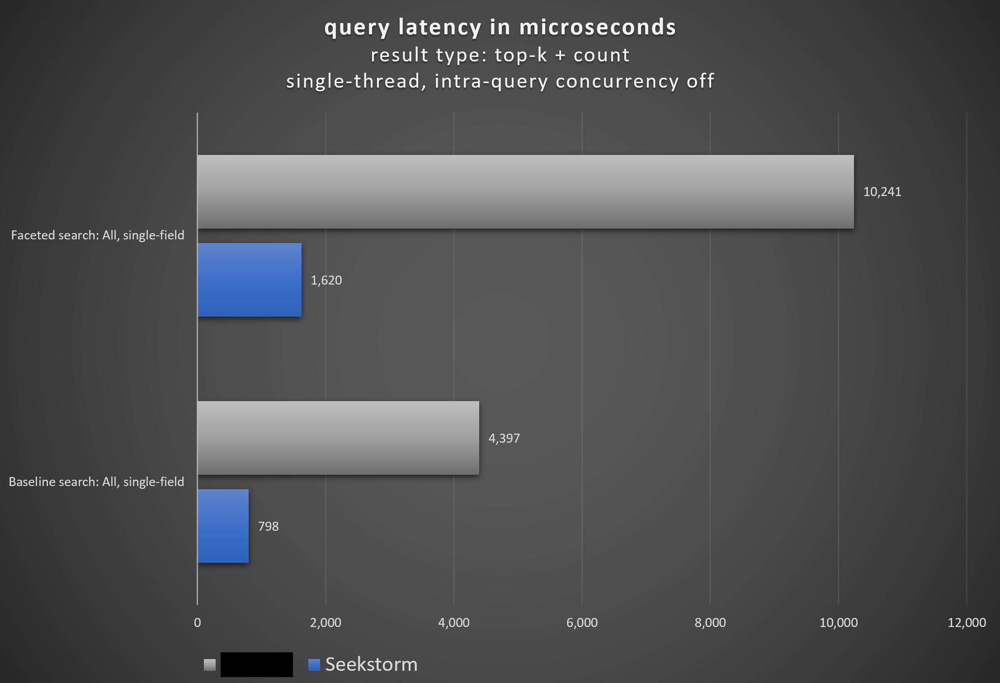

<h1>What is faceted search?</h1>

Searching is an important part of any business database function.<br>
The more the amount of data and documents grows that we need to store, index and retrieve, the higher is the risk that we drown in the sheer amount of results, 
and the more important it becomes to refine the search query and filter results to support finding the most relevant documents to us - the needle in a haystack.
This can be done by **adding extra keywords to the query**, **field search** which restricts the search within certain specified fields only, or **faceted search**.


The [DeepHN.org](https://deephn.org/) demo, powered by SeekStorm, makes heavy use of **faceted search**: for the **domain and hash tag filter** (string facets), the **comment and points filter** (numerical range facets) check boxes on the left, as well as the **date range filter and histogram** (numerical range facets) slider on top.

### Faceted search vs. field search

Faceted search is much more than just a field search. Field search allows you to restrict the search within specified fields, 
but requires you to know both **all available fields** in the indexed documents as well as 
**all unique values per field**. This leads often to trial and error, leaving the user with no or unsatisfactory results. 

Faceted search is not just a filter, but a complete set of filters is automatically generated/derived from the indexed documents.
Faceted search automatically clusters the indexed documents or search results into categories.
The user can then filter and refine the search results by selecting specific values or numeric ranges for each facet field. 
For each facet field the number of search results matching each distinct facet value or numeric range is shown. 
The difference between field filterinng and faceted search is like between open question and multiple choice.

As faceted search allows counting and filtering of documents matching specific facet field values, 
it is often used in product search to narrow down and count the search results according to specific product features like brand, manufacturer, rating, or price.

### Index facets

After indexing, the **index facets** list all available facet fields, their unique values, and count how often a specific value occurs 
**within all indexed documents**. This provides a complete overview of all filtering options **for the entire index**, 
  together with quantitative information about the potential result number for each option.

### Query facets

When searching, the **query facets** list all available facet fields, 
their unique values, and count how often a specific value occurs **within all indexed documents <u>that match a given query</u>**. 
This provides a complete overview of all filtering options **for the current result set**, together with quantitative information about the potential result number for each option.

### Facet filtering, counting &amp; sorting

The **facet filter** specified in the query filters the returned results to those documents both matching the query AND matching for all (boolean AND) specified facet filter fields 
at least one (boolean OR) of the specified values.

If the **query is changed** and/or the **facet filter is changed** then both **search results and facet counts are changed**.

#### String Facets (FieldType::String16 and FieldType::String32)

E.g. the **Language field** of a document may have different values: e.g. English, French, German, Russian, Chinese.

**String facet counting**: Each distinct value is counted across all indexed documents (**index facet**) or all results documents (**query facet**).
The string facets return both information about **which languages exist** and **how often they occur**, 
within all indexed documents (**index facet**) or within in all documents that match the query (**query facet**).

**Facet sorting**: The values within each facet field are sorted by the number of their occurrences in the documents in descending order. 
The number of returned values per facet field can be limited by the parameter **facetvalueslength**.

**Search result filtering**: Besides **counting**, we may also **filter** the results to return only those documents, where the **Language field** contains specific language values e.g. English or French.

**Search result sorting**: The returned search results can be sorted by the (first) value of the specified **facet field** of a document in ascending or descending order.
If no **sort** field is specified, then the results are sorted by rank in descending order per default. 

SeekStorm supports the **String** field type for **String Facet** counting, filtering &amp; sorting.

#### Multi-value string facets (FieldType::StringSet16 and FieldType::StringSet32)

Similar to String facets, but while string facets allow only one value per field per document, String Set facets allow to assign multiple values at the same time per field per document.
Great for e.g. genres, authors, languages, educations, product categories, tags ..., where an item can be associated with multiple values of a field.

#### Numerical Range Facets (FieldType::U8...FieldType::F64)

In contrast to **string facets** which define themselves by the existing distinct values, for **range facets** we have to explicitly **define the ranges** we want to distinguish and count.
E.g. for the **Price field** we want to define price ranges: e.g. 0..10 USD, 10..20 USD, 20..50 USD, 50..100 USD, 100..1000 USD. The ranges may be defined differently for each query. 

**Range facet counting**: Across all results documents (query facet) it is then counted how often a price value falls within one of the defined price ranges.

**Search result filtering**: Besides **counting**, we may also **filter** the results to return only those documents, where the **Price field** value is within the range of 15..25 USD.
The filter range is independent from the defined range facets for counting.

**Search result sorting**: The returned search results can be sorted by the value of the specified **integerFacet, floatFacet, or dateFacet field** of a document in ascending or descending order.
If no **sort** field is specified, then the results are sorted by rank in descending order per default. 

SeekStorm supports **u8, u16, u32, u64, i8, i16, i32, i64, f32, f64** field types for **Numerical Range Facet** counting, filtering &amp; sorting.


### Performance

Faceted search is known to have a heavy impact on search performance. For SeekStorm performance and scaling are always paramount, also for faceted search. 
We went the extra mile to optimize our index architecture so that faceting has only **low impact on the search performance**.



<br>
<hr>
<br>

### Relevant API endpoints

#### [Create index](https://docs.rs/seekstorm/latest/seekstorm/#create-index)

Facet fields allow counting, filtering, and sorting of indexed documents matching specific **facet field values** or **numeric ranges**.

**Create index**: Facet fields are defined in the **schema** parameter of **create_index** by setting the **field_type** to one of the following types: 

```text
u8, u16, u32, u64, i8, i16, i32, i64, f32, f64, String
```
and set
```text
"facet":true
```
in the schema (see code below).

Faceting can be enabled both for string field type and numerical field types.
Both numerical, string and text fields can be indexed (indexed=true) and stored (stored=true) in the json document,
but with field_facet=true a numerical or string field is additionally stored in a binary format, for fast faceting and sorting without document store access (decompression, deserialization).
Setting a numerical field to "facet":true is also the precondition for sorting the search result by this fields value ('score' is treated as a special field to allow sorting by relevancy).

```rust ,no_run
# tokio_test::block_on(async {

use std::path::Path;
use std::sync::{Arc, RwLock};
use seekstorm::index::{IndexMetaObject, SimilarityType,TokenizerType,StopwordType,FrequentwordType,AccessType,StemmerType,NgramSet,create_index};

let index_path=Path::new("C:/index/");//x

let schema_json = r#"
[{"field":"title","field_type":"Text","stored":false,"indexed":false},
{"field":"body","field_type":"Text","stored":true,"indexed":true},
{"field":"url","field_type":"Text","stored":true,"indexed":false},
{"field":"town","field_type":"String16","stored":false,"indexed":false,"facet":true}]"#;
let schema=serde_json::from_str(schema_json).unwrap();

let meta = IndexMetaObject {
    id: 0,
    name: "test_index".to_string(),
    similarity:SimilarityType::Bm25f,
    tokenizer:TokenizerType::AsciiAlphabetic,
    stemmer:StemmerType::None,
    stop_words: StopwordType::None,
    frequent_words:FrequentwordType::English,
    ngram_indexing:NgramSet::NgramFF as u8,
    access_type: AccessType::Mmap,
    spelling_correction: None,
    query_completion: None,
};

let synonyms=Vec::new();

let segment_number_bits1=11;
let index_arc=create_index(index_path,meta,&schema,&synonyms,segment_number_bits1,false,None).await.unwrap();

# });
```

#### [Index document(s)](https://docs.rs/seekstorm/latest/seekstorm/#index-documents)

While the **type** of the facet fields (u8, u16, u32, u64, i8, i16, i32, i64, f32, f64, String) is defined in **create index**, the **value** of those fields
is defined and indexed with **index document**.

**Index document request object**: Each facet field can be assigned a single string values or numerical value per document:<br>

```rust ,no_run
# tokio_test::block_on(async {

use std::path::Path;
use seekstorm::index::{IndexDocuments,open_index};
use seekstorm::commit::Commit;

let index_path=Path::new("C:/index/");
let index_arc=open_index(index_path,false).await.unwrap();

let documents_json = r#"
[{"title":"title1 test","body":"body1","url":"url1","town":"Berlin"},
{"title":"title2","body":"body2 test","url":"url2","town":"Warsaw"},
{"title":"title3 test","body":"body3 test","url":"url3","town":"New York"}]"#;
let documents_vec=serde_json::from_str(documents_json).unwrap();

index_arc.index_documents(documents_vec).await; 

// ### commit documents

index_arc.commit().await;

# });
```

In addition to the facet functionality (counting, filtering, sorting) the facet value can be also indexed to full-text search.<br>
The number of distinct values per string facet field, across the whole index, is limited to 65_535 (String16) and to 4_294_967_295 (String32).<br>
The number of distinct value combinations per string set facet field, across the whole index, is limited to 65_535 (StringSet16) and to 4_294_967_295 (StringSet32).<br>
The string length of a stringFacet value is limited to 100 characters.


#### [Get index string facets](https://docs.rs/seekstorm/latest/seekstorm/index/struct.Index.html#method.get_index_string_facets)

**get_index_string_facets**: list of string facet fields, each with field name and a map of unique values and their count (number of times the specific value appears in the whole index).<br>
Values are sorted by their occurrence count within all indexed documents in descending order.<br> 
The string facets returned with get_index_string_facets are defined and created at index time, not at query time.<br> 
They contain the facet values of the whole index, not only the documents matching a specific query.<br> 
Therefore only string facets can be returned with get_index_string_facets, while numerical range facets are defined at query time and can't be generated at index time.


```rust ,no_run
# tokio_test::block_on(async {

use std::path::Path;
use seekstorm::search::QueryFacet;
use seekstorm::index::{IndexArc,open_index};

let index_path=Path::new("C:/index/");
let index_arc=open_index(index_path,false).await.unwrap();

let query_facets = vec![
    QueryFacet::String16 {
        field: "age".into(),
        prefix: "".into(),
        length: u16::MAX},
];

let string_facets=index_arc.read().await.get_index_string_facets(query_facets).await.unwrap();
println!("{}", serde_json::to_string_pretty(&string_facets).unwrap());

# });
```

**query_facets filter**: If there are many distinct values per facet field, we might want to filter the returned values to those matching a given prefix or limiting the number of returned distinct values.

The **prefix** property of a QueryFacet allows to filter the returned facet values to those matching a given prefix, if there are too many distinct values per facet field.<br>
The **length** property of a QueryFacet allows limiting the number of returned distinct values per facet field, if there are too many distinct values. With length=0 no facts are returned at all.<br>
The values are sorted by the frequency of the appearance of the value within the indexed documents matching the query in descending order.

```rust
use seekstorm::search::QueryFacet;

let query_facets = vec![
    QueryFacet::String16 {
        field: "language".into(),
        prefix: "ger".into(),
        length: 10},
];
```

**get_index_string_facets** returns a **vector of index facets**. For all facet fields, it is counted how often each distinct value occurs **within all indexed documents**.<br>
Within each facet field, the values are sorted by their occurrence count **within all indexed documents** in descending order.

```json
[
  {
    "field": "fruit",
    "values": [
      [
        "Apple",
        41912
      ],
      [
        "Pear",
        41863
      ],
      [
        "Cherry",
        41524
      ],
      [
        "Orange",
        41516
      ],
      [
        "Plum",
        41502
      ]
    ]
  }
]
```

**Range facets** for numerical values are returned with **query documents**, 
where the ranges can be defined dynamically with different boundaries for each query. This allows defining facets ranges like Last hour, last day, last week, last month.<br>


#### [Search index](https://docs.rs/seekstorm/latest/seekstorm/#search-index)

```rust ,no_run
# tokio_test::block_on(async {

use seekstorm::search::{Search, QueryType, ResultType, QueryFacet, QueryRewriting};
use seekstorm::highlighter::{Highlight, highlighter};
use seekstorm::index::open_index;
use std::path::Path;
use std::collections::HashSet;

let index_path=Path::new("C:/index/");
let index_arc=open_index(index_path,false).await.unwrap();

let query="test".to_string();
let offset=0;
let length=10;
let query_type=QueryType::Intersection; 
let result_type=ResultType::TopkCount;
let include_uncommitted=false;
let field_filter=Vec::new();
let query_facets = vec![QueryFacet::String16 {field: "age".into(),prefix: "".into(),length:u16::MAX}];
let facet_filter=Vec::new();
let result_sort=Vec::new();

let result_object = index_arc.search(query, query_type, false, offset, length, result_type,include_uncommitted,field_filter,query_facets,facet_filter,result_sort,QueryRewriting::SearchOnly).await;


// **display results**

let highlights:Vec<Highlight>= vec![
        Highlight {
            field: "body".to_owned(),
            name:String::new(),
            fragment_number: 2,
            fragment_size: 160,
            highlight_markup: true,
            ..Default::default()
        },
    ];    

let highlighter=Some(highlighter(&index_arc,highlights, result_object.query_terms).await);
let return_fields_filter= HashSet::new();
let distance_fields=Vec::new();
let index=index_arc.read().await;
for result in result_object.results.iter() {
  let doc=index.get_document(result.doc_id,false,&highlighter,&return_fields_filter,&distance_fields).await.unwrap();
  println!("result {} rank {} body field {:?}" , result.doc_id,result.score, doc.get("body"));
}
println!("result counts {} {} {}",result_object.results.len(), result_object.result_count, result_object.result_count_total);

// **display facets**

println!("{}", serde_json::to_string_pretty(&result_object.facets).unwrap());

# });
```

**Query**: The query defines which of the indexed documents are returned  as search results.
```text
  query=test
```


**query_facets**: The query_facets parameter specifies for both for string facets and numerical range facets which facet field to return at query time.

**String facets** allow to filter the returned string facet values by prefix and maximum number.
If there are many distinct values per facet field, we might want to filter the returned values to those matching a given prefix or limiting the number of returned distinct values.

The **prefix** property of a QueryFacet allows to filter the returned facet values to those matching a given prefix, if there are too many distinct values per facet field.<br>
The **length** property of a QueryFacet allows limiting the number of returned distinct values per facet field, if there are too many distinct values. With length=0 no facts are returned at all.<br>
With length=0 no query facets are returned, but facet filtering can still be used.<br>
With no facet filter defined the query faceting is completely disabled, resulting in slightly better query performance.<br>
The values are sorted by the frequency of the appearance of the value within the indexed documents matching the query in descending order.

```rust
use seekstorm::search::QueryFacet;

let query_facets = vec![
    QueryFacet::String16 {
        field: "language".into(),
        prefix: "ger".into(),
        length: 10},
];
```

**Numerical range facets** require to **define the ranges** we want to distinguish and count and their labels at query time.

The ranges can be defined arbitrarily. Different bucket widths are allowed within the same range facet field.<br>
The **lower boundary** is defined explicitly (including the number itself).<br> 
The **upper boundary** is defined implicitly by the following boundary (excluding the number itself) or the maximum value allowed for the numeric type.

The ranges may be defined differently for each query. 
This allows to define facets ranges like last hour=current date - 1 hour, last day=current date - 24 hours, last week=current date - 168 hours, 
last month=current date - 5040 hours, where the meaning of **last hour** changes dynamically, 
when you look at the absolute value of the date of the indexed documents you want to include in the results. The number of distinct ranges per range facet field is limited to 65_536, excess ranges are ignored.

The **range_type** property of a QueryFacet allows to specify how to count the frequency of numerical facet field values: **within the specified range**, **within the range and all ranges above**, or **within the range and all ranges below**.

```rust
pub enum RangeType {
    CountWithinRange,
    CountAboveRange,
    CountBelowRange,
}
```

```rust
use seekstorm::search::{QueryFacet,RangeType};

let query_facets = vec![QueryFacet::U8 {
    field: "age".into(),
    range_type: RangeType::CountWithinRange,
    ranges: vec![
        ("0-20".into(), 0),
        ("20-40".into(), 20),
        ("40-60".into(), 40),
        ("60-80".into(), 60),
        ("80-100".into(), 80),
    ],
}];
```

**facet_filter**: Search results are filtered to documents matching specific values in the facet fields.

The filter parameter filters the returned results to those documents both matching the query AND matching for all (boolean AND) stated facet filter fields 
at least one (boolean OR) of the stated values.

If the **query is changed** and/or the **facet filter is changed** then both **search results and facet counts are changed**.

**String facet filter**
```rust
use seekstorm::search::FacetFilter;

let facet_filter = vec![FacetFilter::String16 {
    field: "age".into(),
    filter: vec!["62".into()],
}];
```

**Numerical range facet filter**
```rust
use seekstorm::search::FacetFilter;

let facet_filter = vec![FacetFilter::U8 {
    field: "age".into(),
    filter: 21..65,
}];
```


**result_sort**: Search results can be sorted by any numerical facet field, either in ascending or descending order.

If no sort field is specified, then the search results are sorted by rank in descending order per default.<br>
If there are multiple sort field specified, then the results are ordered by the first field, and then by the second field (tie-break).<br>
A special _score field (BM25x), reflecting how relevant the result is for a given search query (phrase match, match in title etc.) can be combined with any of the other sort fields as primary, secondary or n-th sort criterion.

**Result sort**
```rust
use seekstorm::search::{ResultSort,SortOrder,FacetValue};

let result_sort = vec![ResultSort {
    field: "age".into(),
    order: SortOrder::Ascending,
    base: FacetValue::None,
}];
```

**Query facets result object**: Query facets with counts for all distinct values are returned in **facets** property of the search result.

For all facet fields, it is counted how often each distinct value occurs **within all indexed documents matching the query**.
If the query is **not empty**, then sorted/filtered **query facets** are returned.
If the query is **empty**, then sorted/filtered **index facets** are returned (like with get_index_string_facets).

Within each facet field, the values are sorted by their occurrence count **within all indexed documents matching the query** in descending order.
Numerical range & String value facet counting depend both on the query and on the applied range & string facet filtering.

**String facet result**
```json
[
  {
    "field": "fruit",
    "values": [
      [
        "Apple",
        41912
      ],
      [
        "Pear",
        41863
      ],
      [
        "Cherry",
        41524
      ],
      [
        "Orange",
        41516
      ],
      [
        "Plum",
        41502
      ]
    ]
  }
]
```

**Numerical range facet result**
```json
[
  {
    "field": "age",
    "values": [
      [
        "0-20",
        834014
      ],
      [
        "20-40",
        834091
      ],
      [
        "40-60",
        833311
      ],
      [
        "60-80",
        833288
      ],
      [
        "80-100",
        833363
      ]
    ]
  }
]
```


