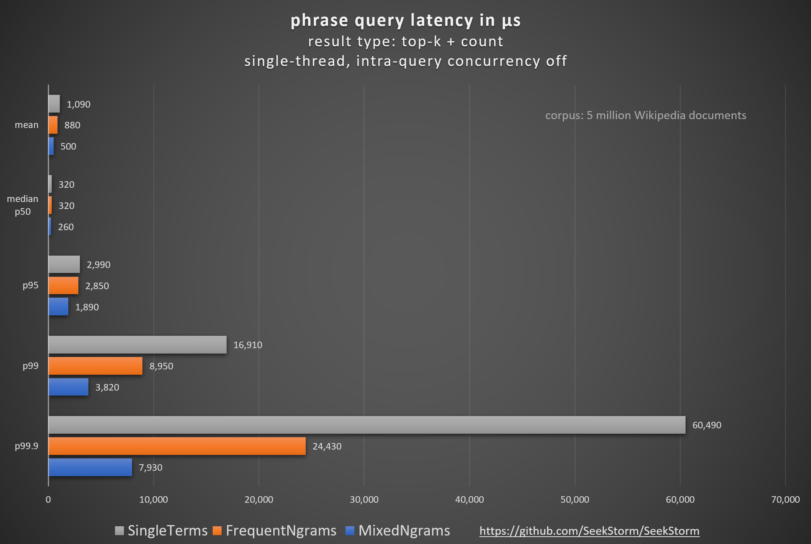

## SeekStorm: N-gram index for faster phrase search: latency vs. index size

### TLDR;

> N-Gram indexing improved **phrase** mean query latency by a **factor of 2.18 (118%)**,  
> p99.9 tail latency by a **factor of 7.63 (663%)**,  
> and some phrase queries up to **3 orders of magnitude**.
>
> The SeekStorm sub-millisecond lexical search library & multi-tenancy server has been implemented in Rust,  
> and is open source licensed under the Apache License 2.0, and is available on [GitHub](https://github.com/SeekStorm/SeekStorm).

### Not all queries and data are made equal

If you strive for the best possible performance, there is no one-fits-all approach.

Depending on the **query type** (union, intersection, phrase) and on the **term frequency** (posting list length) of your data,  
many optimizations can be applied: WAND, MAXSCORE, roaring bitmaps, SIMD, galloping, sharded index. Another interesting optimization is N-gram indexing.

### What are N-grams

In general, N-grams are contiguous sequences of n adjacent items (**words**, **characters**, or **symbols**) extracted from a text. 

In SeekStorm, N-grams are contiguous sequences of two or three frequent and/or rare **terms** as **opposed to character sequences** (see below for a list of supported N-gram types), extracted from a document or query.

### What are frequent terms?

SeekStorm allows different N-gram types, each defined as a combination of two or three frequent and/or rare terms.
But what is the distinction between a frequent and a rare term? It is the number of times a term occurs within the index.
**Rarer terms** have a **higher discriminatory value**, which is also honoured by the BM25 formulae. 
**Frequent terms**, on the other hand, have a **lower discriminatory value**, but due to their frequent occurrence, they **take up a lot of index space** and **computing resources** during intersection.
Therefore, they are sometimes even excluded from indexing as **stop words**. But this is no perfect solution, as there are valid queries, like *"The Who"* or *"The Doors"*, consisting of or containing frequent terms.
But where is the exact frontier, where a rare term becomes a frequent term and vice versa? There is no general definition.
It's up to the user to define the frequent terms, and all other terms are treated as rare terms. In SeekStorm, this is done by providing a list of user-defined frequent terms during index creation.

When defining frequent terms, you can simply take what would be considered **stop words** in the language of the documents you are indexing.  
The more terms you add to the frequent terms list, the more queries will benefit from the latency advantage of N-grams, at the cost of a higher index size.
The more frequent a term is, that is added to the frequent term list, the more pronounced is its latency benefit compared to its induced index size cost.

Frequent terms are rare - i.e., there are only a few terms that frequently appear in almost every document.
We prefer combinations of frequent terms in n-grams for two reasons:  
1. Frequent terms have long posting lists, and their conventional intersection would be expensive. By using N-grams instead, we can save the most, which otherwise would be the most expensive.
2. Because there are only a few frequent terms, the number of combinations with frequent terms and thus their additional index size cost is limited too. We optimize the **fat head** instead of the **long tail**.

### How about automatic detection of frequent terms during indexing?

**Benefits**
* language independent, 
* no pre-definition of frequent terms required

**Drawbacks**
* When indexing starts, we have no information about term frequency. We either need to index the first block without frequent terms and N-grams, or we need to reindex it once we have term frequencies collected.
* Term frequencies might also change during indexing. Then we either need to reindex everything from scratch, or have different frequent terms per level, which would also require a different query rewriting to N-grams per block.

In SeekStorm, we forgo automatic detection of frequent terms, which makes both indexing and query more complicated and complex, in favor of a predefined set of frequent terms during index definition.

### How does N-gram phrase search work?

The intersection of frequent terms is challenging because their posting lists are very long, and the intersection takes a lot of time. Especially when very frequent terms (aka stopwords) are involved,  
which occur in almost every document, that might significantly contribute to tail latencies.

Examples of those queries are “The Who”, “Take That”, "Who is Who", “Let it be”, “To be or not to be”, "End of Days", "The The", "What might have been".

One way to significantly reduce the query latency is by indexing N-grams in addition to single terms, essentially moving the computation of intersection and phrase matching from query time to indexing time.

When we use N-gram indexing also for phrase search of rare terms besides frequent terms, or even for intersection (AND) by removing the condition that the N-gram terms have to be adjacent, this significantly
increases the index size.

Such an approach has been used in the [distributed web search engine FAROO](https://en.wikipedia.org/wiki/Distributed_search_engine). 
To keep the index size manageable, highly discriminative keys (HDK), noun-only indexing, aggressive stemming, and other keyword reduction techniques have been used.

But when N-grams are restricted only to adjacent frequent terms, then the additional index cost in terms of space and time is negligible. 
On the other hand, those queries containing multiple adjacent frequent terms might be accelerated by 3 orders of magnitude,  
because the posting list of the N-gram is much shorter than those of the original single terms. Also, for phrase queries of two or three frequent terms, no intersection and phrase matching is necessary anymore.  
The phrase matching of consecutive N-grams (sequences containing frequent terms) and single terms (rare terms) is accelerated as well, as it becomes the intersection between a very short N-gram posting list and the other terms. This enables the use of additional accelerating techniques like galloping.

While BM25 is not ideal for phrase search as it doesn't honour term proximity, we might still want to use it for comparability so that the BM25 score and the topk results are identical whether we are using N-gram indexing (for performance) or not.

To make N-gram indexing compatible with BM25 ranking, we have to implement additional measures. We store the posting_counts (DF) and the positions_count of the partial terms (TF) of the N-gram for BM25 calculation.
While we could have used the positions_count stored in the posting lists of single terms, it would be expensive to find the docid within the posting lists (docid/pointer list) of single terms via custom binary search. That would nullify the speed advantage of N-gram indexing. Therefore, we sacrifice some space to store the positions_counts of the single term together with the positions of the N-gram.

N-gram indexing is orthogonal to other acceleration techniques mentioned above.

### Traditional phrase search vs. N-gram phrase search

A traditional phrase search consists of two steps: 
1. First, we intersect two single-term posting lists (e.g., by merging and galloping).  
2. Then, for each intersection match, we have to do a phrase check, by checking whether or not the term positions in the document are adjacent in the order of the phrase query terms.  
For long posting lists that can be expensive.

**Both steps - intersection and phrase check - can be eliminated** if we already precalculate N-grams (bigram and trigram phrase matches) at index time.  
Then, at query time, for two- and three-term queries, the result list is directly available by accessing the appropriate n-gram posting lists.  
For phrase queries longer than three terms, the queries can be transformed to queries with fewer terms, consisting of n-grams.  
After rewriting the query to N-grams, we have fewer terms, each with shorter posting lists, reducing the effort for intersection and the subsequent phrase check.

### N-grams and tokenizer

N-grams are generated in the tokenizer, both for indexing and search.

For indexing all possible variants of overlapping N-grams are generated.
For searching a single variant of non-overlapping N-grams is chosen.

We currently use a greedy algorithm for selecting the best N-grams for query rewriting.  
We have also experimented with dynamic programming, and I adapted my [Fast Word Segmentation algorithm](https://seekstorm.com/blog/fast-word-segmentation-noisy-text/) (already ported from C# to Rust for the Chinese word segmentation in SeekStorm) for N-gram query rewriting using the Viterbi algorithm (Naive Bayes).  
But according to my benchmarks, the additional effort for Viterbi over Greedy was not always justified.

### N-grams and BM25

BM25 scores (`SimilarityType::Bm25f`) are almost identical for both n-gram and single-term indexing. There are only small differences for phrase search resulting from  
normalization (32bit->8bit->32bit lossy logarithmic compression/decompression) that is used for posting_count_ngram1/2/3, but not for single term posting_counts.

This is achieved as we store for every partial term of an n-gram its document frequency (DF), i.e. the number of documents a term occurs in.  
We also store for every partial term of an n-gram its term frequency (TF), i.e., the number of positions within a document.

For the alternative BM25 proximity score (`SimilarityType::Bm25fProximity`) we use DF and TF of the N-gram, as opposed to the DF and TF of its partial terms.  
This way, the proximity of terms within an N-gram is honored for scoring.  
But then we can't anymore score the posting list length and position count of the individual 2 or 3 ngram terms independently,  
as we store only the posting list length and position count of the N-gram itself, but not its partial terms. 

**Example query: "tallest trees in the world"**

| Top-10 DocID | SingleTerm Bm25f | Top-10 DocID | faithful N-gram Bm25f | Top-10 DocID | N-gram Bm25fProximity |
| ---: | ---: | ---: |  ---: | ---: |  ---: | 
| 2456001 | 16.940866 | 2456001 | 17.131088 |  891973 | 8.5893530 |
| 1615029 | 16.919497 | 1615029 | 17.113970 | 2456001 | 8.5521690 |
| 891973  | 16.165619 |  891973 | 16.351793 | 1615029 | 7.5108185 |
| 2094543 | 13.590414 | 2094543 | 13.776010 | 2094543 | 6.4961680 |
| 1162534 | 13.225990 | 1162534 | 13.413112 | 1162534 | 6.2484310 |
| 2676541 | 7.4227843 | 2676541 | 7.5982113 | 3494456 | 4.9255943 |
| 3494456 | 7.3537903 | 3494456 | 7.5184870 | 3308553 | 4.3953430 |
| 3308553 | 7.0942807 | 3308553 | 7.2625637 |  958861 | 4.1408840 |
|  958861 | 6.9975886 |  958861 | 7.1672870 | 2676541 | 2.5677156 |
| 3513862 | 3.1011164 | 3513862 | 3.2637115 | 3513862 | 1.6718745 |

The small differences between SingleTerm Bm25f and faithful N-gram Bm25f are caused  
by lossy logarithmic compression/decompression of posting_count_ngram1/2/3,  
but the **order of the top-10 DocID is mostly preserved**.

### SeekStorm N-gram indexing

SeekStorm had **bigram indexing** of two adjacent frequent terms from the very beginning.  
This allows for very fast phrase search of phrase mode of frequent terms, e.g., "The Who" (the rock band).  
And bi-grams of frequent terms deliver 'the best bang for the buck' in terms of latency improvement vs. index size increase trade-off, as we will see below.

But starting with **SeekStorm v0.13.0**, we go a step further with a more **generalized approach to n-gram indexing**.  
Instead of only indexing two frequent terms as a bigram in addition to the single term, we allow fo indexing the following term combinations as N-grams:

* SingleTerm 
* NgramFF  : frequent frequent
* NgramFR  : frequent rare
* NgramRF  : rare frequent
* NgramFFF : frequent frequent frequent
* NgramRFF : rare frequent frequent
* NgramFFR : frequent frequent rare
* NgramFRF : frequent rare frequent

During index creation, the user can define **any combination** of the above N-gram types to be supported during indexing and search. SingleTerm indexing is **always** enabled.

N-gram indexing **reduces the latency**, but **only for phrase search**. Some phrase queries are **3 orders of magnitude** faster.  
But N-gram indexing comes at the cost of **increasing** both **index size** and **indexing time**.  

While it's not easy to go faster if you are already using the fastest processor, it is easy to go faster with N-gram indexing by sacrificing some storage space, as you usually haven't maxed out disk capacity yet.  
Also, upgrading storage is usually much more affordable than upgrading to a faster processor.

With N-gram indexing, SeekStorm follows the successful [SymSpell](https://github.com/wolfgarbe/SymSpell) pattern: trade index space and indexing time for query speed - as an option.

We provide benchmarks for latency, indexing speed, and index size to allow the user to make an informed decision about when to use N-gram indexing.

Every use case is different, with different data and different trade-off preferences. With SeekStorm v0.13.0, you now have a choice.

### How about rewriting AND queries to Phrase queries?

Unfortunately, the use of explicit phrase queries by typing "" is not internalized by the average user,  
even if his intent was obviously to perform a phrase query.

How about rewriting AND queries to Phrase queries? This would allow AND queries to profit from the faster speed of N-gram phrase queries.  
But it comes at a cost. If the AND query was not intended as a phrase query, we might get insufficient results with bad recall.

There are some heuristics. If the user is searching for two frequent terms or a rare and a frequent term, it is most likely intended as a phrase query,  
just because a frequent term outside a phrase doesn't add much discriminatory value to the query.

Another way is to start with rewriting the query as a phrase query. This will not only speed up the query but also lead to more relevant results.  
In the case that not enough results are found, we could fall back to a normal AND/OR query.

> Traditional Phrase search is always slower than AND search, because Phrase search = AND search + additional Phrase check.  
> But for N-gram Phrase search, usually the opposite is true. That's why rewriting AND queries to N-gram Phrase queries is worth considering.

### Could we use the N-gram principle for intersection (AND) search?

Not exactly. Because n-grams are consecutive occurrences of terms in a document, they are suitable for phrase search only.
In AND search, the terms of a query might occur everywhere within a document, and thus wouldn't be covered by N-grams.

But there is something slightly similar: Keyword combination indexing. We could derive all keyword combinations that occur within a document and index those combinations in addition to the single terms and N-grams.
This would be essentially a precalculation of AND search at indexing time, and offer the same speed benefits to AND search that N-Gram indexing offers for Phrase search.

There is only one problem: The associated cost of naive keyword combination indexing in terms of index size and indexing time is unbearable. 
The number of combinations without repetition is C(n, k) = ∑ᵢ₌₁..ₖ  n! / (i!(n-i)!),
where n is the number of unique terms in a document and k is the keyword combination length, 
i.e., the maximum number of terms in an AND query we want to support = the maximum number of terms in a keyword combination we need to index.

E.g., a document with 200 unique terms and a maximum query length of 5 ≈ 2.600.000.000 combinations we need to index!

Luckily, there are several compression methods to significantly reduce the number of keyword combinations per document:
* Stopword removal
* Stemming
* Highly discriminative keys (HDK) 
* Indexing title only
* Indexing highly relevant documents only
* verb removal - indexing nouns only

HDK (high discriminative key) is an interesting concept, where keyword combinations are only formed from frequent terms and term combinations, until the resulting term combination becomes **intrinsically rare**.  
In a second step, within those intrinsically rare posting lists, a full check of all query terms is done within bloom filters of terms associated with every document in the intrinsically rare posting list.  
For details, see [Scalable Peer-to-Peer Web_Retrieval with Highly Discriminative Keys](https://www.researchgate.net/publication/4250903_Scalable_Peer-to-Peer_Web_Retrieval_with_Highly_Discriminative_Keys).

Some of the above methods are reducing recall, but increasing relevancy. This could be useful in a two-tier approach, where we first try to find results with fast keyword combination search,  
and only if that fails, we would fall back to slow conventional intersection.

I have used keyword combination indexing successfully 20 years ago when implementing the FAROO decentralized peer-to-peer web search engine.
We used a DHT (distributed hash table) to store the posting lists at different peers (with a 20-fold redundancy to fight churn). 
As it was infeasible to transfer long posting lists between peers and users in real-time at search time, we had to find a solution for intersection without posting list transfer.
That's why we back then chose keyword combination indexing.

### Benchmarks

Benchmark results highly depend on the selected data and query set, as well as on the hardware and software environment.  

We are using the **English Wikipedia** data and queries derived from the **AOL query dataset**, both from Tantivy's [search-benchmark-game](https://github.com/quickwit-oss/search-benchmark-game/).  
The benchmark has been executed in single-thread, single-shard mode without caching.

The results were generated using the following benchmark environment:
* ThinkPad P1 Gen 6
* Processor Intel(R) Core(TM) i7-13700H
* SK hynix 2TB SSD PCIe 4.0 NVMe M.2
* Ubuntu 24.04 LTS
* Rust 1.88
* OpenJDK 17

#### Comparison of different N-gram type combinations in terms of **phrase** query latency

  
<br><br>

| Library | N-gram type | mean (µs) | factor | p50 (µs) | factor | p95 (µs) | factor | p99 (µs) | factor | p99.9 (µs) | factor |
| --- | --- | ---: | ---: | ---: | ---: | ---: | ---: | ---: | ---: | ---: | ---: |
| **SeekStorm 0.13.0** | **Single Terms**               | **1,090** | **1.00** | **320** | **1.00** | **2,990** | **1.00** | **16,910** | **1.00** | **60,490** | **1.00** | 
| SeekStorm 0.13.0 | Frequent Bigrams                   |   890 | 1.22 | 320  | 1.00 | 3,180 | 0.94 | 10,230 | 1.65 | 26,070 | 2.32 |
| **SeekStorm 0.13.0** | **Frequent Bigrams/Frequent Trigrams** |   **880** | **1.24** | **320** | **1.00** | **2,850** | **1.05** | **8,950** | **1.89** | **24,430** | **2.48** |
| SeekStorm 0.13.0 | Frequent Bigrams/Mixed Trigrams    |   820 | 1.33 | 310 | 1.03 | 2,890 | 1.03  | 8,440 | 2.00 | 24,840 | 2.44 |
| SeekStorm 0.13.0 | Mixed Bigrams                      |   510 | 2.14 | 260 | 1.23 | 1,050 | 2.84 | 3,800 | 4.45 | 8,050 | 7.51 |
| **SeekStorm 0.13.0** | **Mixed Bigrams/Frequent Trigrams**    |   **500** | **2.18** | **260** | **1.23** | **1,890** | **1.58** | **3,820** | **4.43** | **7,930** | **7.63** |
| SeekStorm 0.13.0 | Mixed Bigrams/Mixed Trigrams       |   510 | 2.14 | 270 | 1.19 | 1,790 | 1.67 | 3,850 | 4.39 |  8,180 | 7.39 |

7 (Frequent Bigrams) vs. 51 (Mixed Bigrams + Mixed Trigrams) of 903 queries in the benchmark are benefiting from N-gram indexing.  
Those are usually the most challenging ones, causing high tail latencies.

> N-gram indexing can help to drastically reduce tail latencies.  

For more information on tail latencies see our blog post [Tail latencies and percentiles](https://seekstorm.com/blog/tail-latencies-and-percentiles/).

#### The cost of N-grams: index size and indexing time

| Library | N-gram type | Index size (byte) | factor | Indexing time (s) | factor |
| --- | --- |  ---: |  ---: | ---: | ---: |
| **SeekStorm 0.13.0** | **Single Terms**               | **3.880.714.411** | **1.00** | **558** | **1.00** |
| SeekStorm 0.13.0 | Frequent Bigrams                   | 4.476.185.397 | 1.15 | 605 | 1.08 |
| **SeekStorm 0.13.0** | **Frequent Bigrams/Frequent Trigrams** | **4.613.052.374** | **1.19** | **636** | **1.14** |
| SeekStorm 0.13.0 | Frequent Bigrams/Mixed Trigrams    | 9.680.952.871 | 2.49 | 2203 | 3.95 |
| SeekStorm 0.13.0 | Mixed Bigrams                      | 11.314.218.483 | 2.92 | 2138 | 3.83 |
| **SeekStorm 0.13.0** | **Mixed Bigrams/Frequent Trigrams**    | **11.531.297.587** | **2.97** | **2204** | **3.95** |
| SeekStorm 0.13.0 | Mixed Bigrams/Mixed Trigrams       | 16.599.113.374 | 4.28 | 4164 | 7.46 |

#### Some challenging phrase queries containing frequent terms:

### ["the who"](https://en.wikipedia.org/wiki/The_Who)

| Library | N-gram type | Phrase query latency (µs) | factor | N-gram query rewriting |
| --- | --- | ---: | ---: | --- |
| SeekStorm 0.13.0 | Single Terms                       | 151,850 | 1.00 | the wo |
| **SeekStorm 0.13.0** | **Frequent Bigrams**           | **120** | **1,265.00** | **the_who** |
| SeekStorm 0.13.0 | Frequent Bigrams/Frequent Trigrams | 140 | 1.084.64 | the_who |
| SeekStorm 0.13.0 | Frequent Bigrams/Mixed Trigrams    | 130 | 1,178.08 | the_who |
| SeekStorm 0.13.0 | Mixed Bigrams                      |  90 | 1,687.00 | the_who |
| SeekStorm 0.13.0 | Mixed Bigrams/Frequent Trigrams    |  80 | 1,898.12 | the_who |
| SeekStorm 0.13.0 | Mixed Bigrams/Mixed Trigrams       | 140 | 1.084.64 | the_who |

### ["the doors"](https://en.wikipedia.org/wiki/The_Doors)

| Library | N-gram type | Phrase query latency (µs) | factor | N-gram query rewriting |
| --- | --- | ---: | ---: | --- |
| SeekStorm 0.13.0 | Single Terms                       | 8,160 |  1.00 | the doors |
| SeekStorm 0.13.0 | Frequent Bigrams                   | 9,500 |  0.86 | the doors |
| SeekStorm 0.13.0 | Frequent Bigrams/Frequent Trigrams | 7,480 |  1.09 | the doors |
| SeekStorm 0.13.0 | Frequent Bigrams/Mixed Trigrams    | 8,890 |  0.92 | the doors |
| **SeekStorm 0.13.0** | Mixed Bigrams                  | **130** | **62.77** | **the_doors** |
| SeekStorm 0.13.0 | Mixed Bigrams/Frequent Trigrams    |   140 | 58.29 | the_doors |
| SeekStorm 0.13.0 | Mixed Bigrams/Mixed Trigrams       |   140 | 58.29 | the_doors |

### ["who is who"](https://en.wikipedia.org/wiki/Who%27s_Who)

| Library | N-gram type | Phrase query latency (µs) | factor | N-gram query rewriting |
| --- | --- | ---: | ---: | --- |
| SeekStorm 0.13.0 | Single Terms                       | 65,220 |     1.00 | who is who |
| SeekStorm 0.13.0 | Frequent Bigrams                   |  8,280 |     7.88 | who_is who |
| **SeekStorm 0.13.0** | **Frequent Bigrams/Frequent Trigrams** | **70** | **931.71** | **who_is_who** |
| SeekStorm 0.13.0 | Frequent Bigrams/Mixed Trigrams    |     80 |   815.25 | who_is_who |
| SeekStorm 0.13.0 | Mixed Bigrams                      |  9,940 |     6.56 | who_is who |
| SeekStorm 0.13.0 | Mixed Bigrams/Frequent Trigrams    |     80 |   815.25 | who_is_who |
| SeekStorm 0.13.0 | Mixed Bigrams/Mixed Trigrams       |     60 | 1,087.00 | who_is_who |

### ["to be or not to be"](https://en.wikipedia.org/wiki/To_be,_or_not_to_be)

| Library | N-gram type | Phrase query latency (µs) | factor | N-gram query rewriting |
| --- | --- | ---: | ---: | --- |
| SeekStorm 0.13.0 | Single Terms                       | 60,880 | 1.00 | to be or not to be |
| SeekStorm 0.13.0 | Frequent Bigrams                   |  2,190 | 27.80 | to_be or_not to_be |
| **SeekStorm 0.13.0** | **Frequent Bigrams/Frequent Trigrams** | **220** | **276.73** | **to_be_or not_to_be** |
| SeekStorm 0.13.0 | Frequent Bigrams/Mixed Trigrams    |   240 | 253.67 | to_be_or not_to_be |
| SeekStorm 0.13.0 | Mixed Bigrams                      | 4,080 |  14.92 | to_be or_not to_be |
| SeekStorm 0.13.0 | Mixed Bigrams/Frequent Trigrams    |   250 | 243.52 | to_be_or not_to_be |
| SeekStorm 0.13.0 | Mixed Bigrams/Mixed Trigrams       |   170 | 358.12 | to_be_or not_to_be |

### ["pump it up"](https://en.wikipedia.org/wiki/Pump_It_Up!)

| Library | N-gram type | Phrase query latency (µs) | factor | N-gram query rewriting |
| --- | --- | ---: | ---: | --- |
| SeekStorm 0.13.0 | Single Terms                       | 2,220 |  1.00 | pump  it  up |
| **SeekStorm 0.13.0** | **Frequent Bigrams**           | **200** | **11.10** | **pump it_up** |
| SeekStorm 0.13.0 | Frequent Bigrams/Frequent Trigrams |   210 | 10.57 | pump it_up |
| SeekStorm 0.13.0 | Frequent Bigrams/Mixed Trigrams    |    50 | 44.40 | pump_it_up |
| SeekStorm 0.13.0 | Mixed Bigrams                      |   310 |  7.16 | pump_it up |
| SeekStorm 0.13.0 | Mixed Bigrams/Frequent Trigrams    |   310 |  7.16 | pump_it up |
| SeekStorm 0.13.0 | Mixed Bigrams/Mixed Trigrams       |    70 | 31.71 | pump_it_up |

### Recommended N-gram combinations

Not all that is possible makes sense for everybody, with every workload.  
Here we propose a sensible trade-off between query performance improvement and index size cost, while preventing diminishing returns.

> Looking at the benchmark results above and the associated index size cost, at first glance, it looks unreasonable to accept a 3x higher index size.  
> But in order to reduce tail latency by a factor of 8, it would be much easier and less expensive to increase the disk capacity by a factor of 3, than to have 8x faster processors or increase the node number by a factor of 8.  
> Furthermore, for medium-sized indices (<100 GB), index size is usually no concern at all, but (tail) latency is.

For workloads where the **minimum index size** is more important than phrase query latency, we recommend **Single Terms**:  
```rust
NgramSet::SingleTerm as u8
```

For workloads with a **good balance of performance and index size** cost, we recommend **Single Terms + Frequent Bigrams + Frequent Trigrams**:  
```rust
NgramSet::SingleTerm as u8 | NgramSet::NgramFF as u8 | NgramSet::NgramFFF
```

For workloads where **minimal phrase query latency** is more important than low index size, we recommend **Single Terms + Mixed Bigrams + Frequent Trigrams**: 
```rust
NgramSet::SingleTerm as u8 | NgramSet::NgramFF as u8 | NgramSet::NgramFR as u8 | NgramSet::NgramRF | NgramSet::NgramFFF
```

### Summary

N-Gram indexing improved latency for **some** **phrase** queries, at the cost of higher index size and indexing time.
The improvements for tail latencies are even higher than for mean query latency.

Using N-gram indexing, the following **phrase search** improvements have been measured:
* mean query latency by **factor 2.18 (118%)**
* p99.9 tail latency by **factor 7.63 (663%)**
* Some queries are up to **3 orders of magnitude** faster: e.g., "the who" by a factor of 1687 (168,600%)

To implement N-gram indexing for faster phrase search, 30% of 25K LoC of the SeekStorm codebase have been added, removed, or changed.

### Further improvements

So far, we have indexed the N-grams that occurred in the documents, independent of the likelihood that they will appear in queries. 
With a probabilistic approach (i.e., via query log file analysis), we can judge how likely certain N-grams are to appear in queries, and we can abstain from indexing less likely N-grams.  

The more likely N-grams can be stored in a Bloom filter, which is consulted during indexing and search to determine whether or not to combine terms into N-grams.
This will significantly reduce the index size and indexing time overhead of N-gram indexing, while mostly maintaining its query latency benefits.  

The achieved space savings can be used to increase the number of terms deemed to be frequent, and thus further improve (tail) latencies for more phrase queries.  

### Source code

The SeekStorm sub-millisecond lexical search library & multi-tenancy server has been implemented in Rust,  
is open source licensed under the Apache License 2.0, and is available on [GitHub](https://github.com/SeekStorm/SeekStorm).


