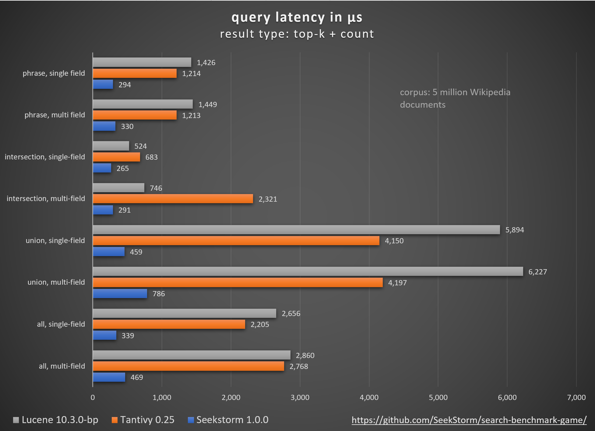
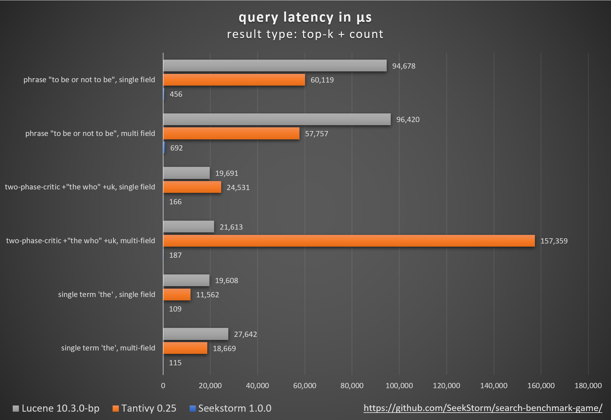
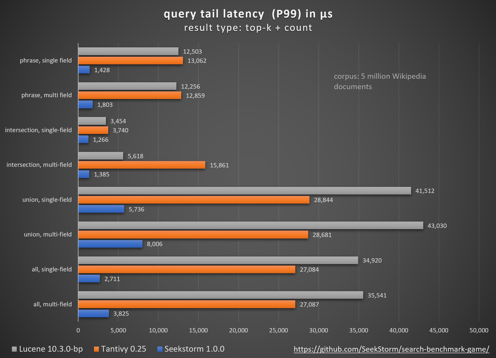
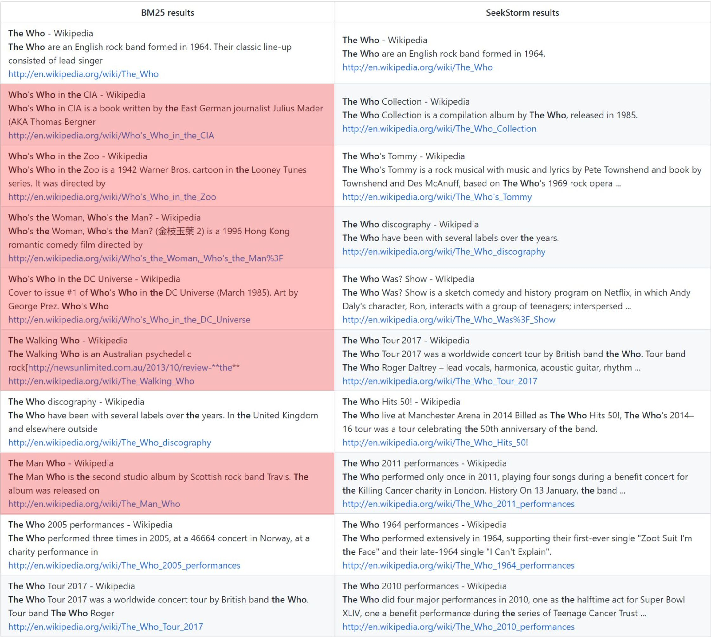
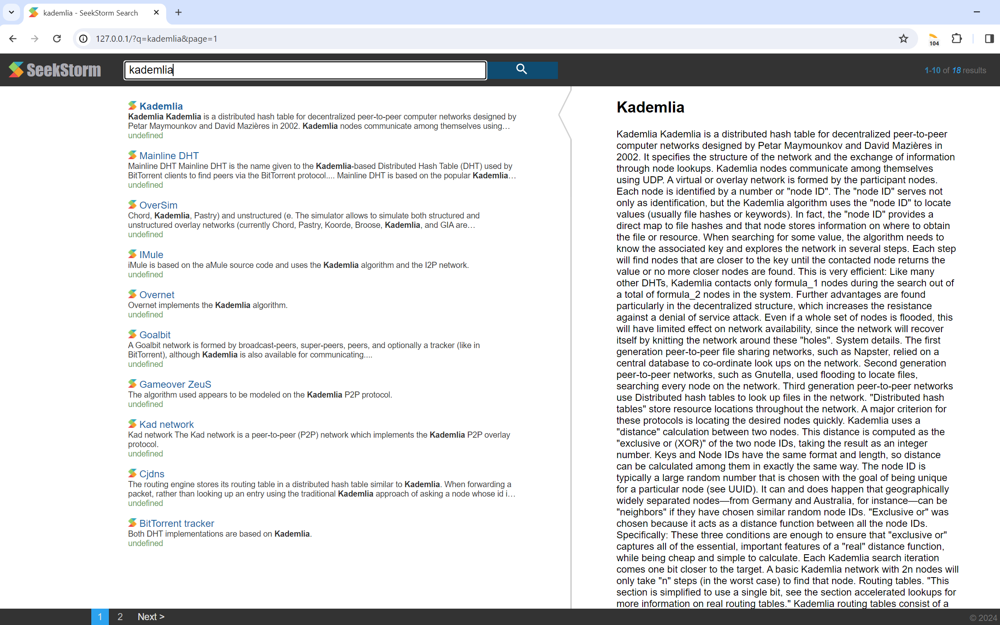
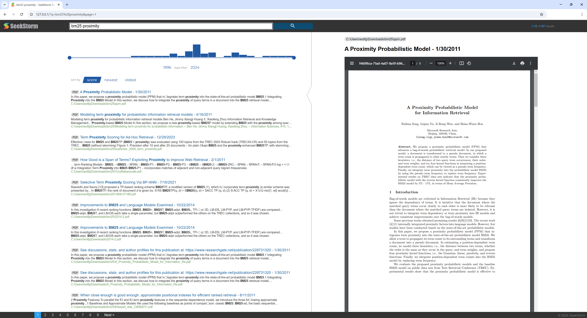

<br>
[](https://crates.io/crates/seekstorm)
[](https://crates.io/crates/seekstorm)
[](https://docs.rs/seekstorm)
[](https://github.com/SeekStorm/SeekStorm?tab=Apache-2.0-1-ov-file#readme)
[](https://hub.docker.com/r/wolfgarbe/seekstorm_server)
[](#roadmap)
<p>
  <a href="https://seekstorm.com">Website</a> | 
  <a href="https://seekstorm.github.io/search-benchmark-game/">Benchmark</a> | 
  <a href="https://deephn.org/">Demo</a> | 
  <a href="#documentation">Library Docs</a> | 
  <a href="https://seekstorm.github.io/documentation/">Server Docs</a> |
  <a href="https://github.com/SeekStorm/SeekStorm/blob/main/src/seekstorm_server/README.md">Server Readme</a> |
  <a href="#roadmap">Roadmap</a> | 
  <a href="https://seekstorm.com/blog/">Blog</a> | 
  <a href="https://x.com/seekstorm">Twitter</a>
</p>

---

**SeekStorm**: **sub-millisecond**, native **vector** & **lexical search** - **in-process library** & **multi-tenancy server**, in **Rust**.

Development started in 2015, in [production](https://seekstorm.com) since 2020, Rust port in 2023, open sourced in 2024, work in progress.

SeekStorm is open source licensed under the [Apache License 2.0](https://github.com/SeekStorm/SeekStorm?tab=Apache-2.0-1-ov-file#readme)

Blog Posts: 
- [SeekStorm is now Open Source](https://seekstorm.com/blog/sneak-peek-seekstorm-rust/)
- [SeekStorm gets Faceted search, Geo proximity search, Result sorting](https://seekstorm.com/blog/faceted_search-geo-proximity-search/)
- [SeekStorm sharded index architecture - using a multi-core processor like a miniature data center](https://seekstorm.com/blog/SeekStorm-sharded-index-architecture/)
- [N-gram index for faster phrase search: latency vs. size](https://seekstorm.com/blog/n-gram-indexing-for-faster-phrase-search/)
- [Typo-tolerant Query auto-completion - derived from indexed documents](https://seekstorm.com/blog/query-auto-completion-(QAC)/)
- [SeekStorm 3.0 adds vector search & hybrid search](https://seekstorm.com/blog/seekstorm-adds-vector_search-hybrid-search/)

### SeekStorm high-performance search library

#### Hybrid search
* Internally, SeekStorm uses [**two separate, first-class, native index architectures**](ARCHITECTURE.md#architecture) for **vector search** and **keyword search**. Two native cores, not just a retrofit, add-on layer.
* SeekStorm doesn’t try to make one index do everything. It runs two native search engines and lets the query planner decide how to combine them.
* Two **native** index architectures under one roof:
  - **Lexical search**: an inverted index optimized for lexical relevance, 
  - **Vector search**: an ANN index optimized for vector similarity.
* Both are first-class engines, integrated at the query planner level.
  - Query planner with multiple QueryModes and FusionTypes
  - **Per query choice** of lexical search, **vector search**, or **hybrid search**.
* Separate internal index, storage layouts, indexing, search, scoring, top-k candidates - unified query planner and result fusion (Reciprocal Rank Fusion - RRF).
* But the user is fully shielded from the complexity, as if it was only a single index.
* Enables pure lexical, pure vector or hybrid search (exhaustive, not only re-ranking of preliminary candidates). 

#### Architecture
* *Fast* sharded indexing: 35K docs/sec = 3 billion docs/day on a laptop.
* *Fast* sharded search: [7x faster query latency, 17x faster tail latency (P99)](#benchmarks) for lexical search.
* Billion-scale index
* Index either in RAM or memory mapped files
* Cross-platform (Windows, Linux, MacOS)
* SIMD (Single Instruction, Multiple Data) hardware acceleration support,  
  both for x86-64 (AMD64 and Intel 64) and AArch64 (ARM, Apple Silicon).
* Single-machine scalability: serving thousands of concurrent queries with low latency from a single commodity server without needing clusters or proprietary hardware accelerators.
* 100% human 😎 craftsmanship - No AI 🤖 was forced into vibe coding/AI slop.

#### Vector Features
* **Multi-Vector indexing**: both from multiple fields and from multiple chunks per field.
* **Integrated inference**: Generate and index embeddings from any text document field, using [Model2Vec from MinishLab](https://github.com/MinishLab/model2vec-rs).
* Alternatively, import and index externally generated embeddings.
* Multiple vector precisions: F32, I8.
* Multiple similarity measures: Cosine similarity, Dot product, Euclidean distance.
* **TurboQuant** (TQ) and affine **Scalar Quantization** (SQ).
* **Chunking** that respects **sentence boundaries** and **Unicode segmentation** for multilingual text.
* **K-Medoid clustering**: PAM (Partition Around Medoids) with actual data points as centers.
* **Sharded and leveled IVF index**.
* **Approximate Nearest Neighbor Search** (ANNS) in an **Leveled IVF index**.
* All **field filters** are directly active **during vector search**, not just as post-search filtering step.
* SIMD (AVX2) acceleration for vector quantization and similarity calculation.

#### Lexical Features
* **BM25F** and **BM25F_Proximity** ranking
* 6 tokenizers, including **Chinese word segmentation**.
* **Stemming** for 38 languages.
* Optional **stopword lists**, custom and predefined, for smaller indices and faster search.
* **Frequent word lists**, custom and predefined, for faster phrase search by N-gram indexing.
* Inverted index
* **Roaring-bitmap** posting list compression.
* **N-gram indexing**
* **Block-max WAND** and **Maxscore** acceleration

#### General Features
* **True real-time search**, both for **vector search** and **lexical search**, with negligible performance impact
* Incremental indexing
* Unlimited field number, field length & index size
* Compressed document store: ZStandard
* Field filtering
* [Faceted search](https://github.com/SeekStorm/SeekStorm/blob/main/FACETED_SEARCH.md): Counting & filtering of String & Numeric range facets (with Histogram/Bucket & Min/Max aggregation)
* Result sorting by any field, ascending or descending, multiple fields combined by "tie-breaking". 
* Geo proximity search, filtering and sorting.
* Iterator to iterate through all documents of an index, in both directions, e.g., for index export, conversion, analytics and inspection.  
* Search with empty query, but query facets, facet filter, and result sort parameters, ascending and descending.
* Typo tolerance / Fuzzy queries / Query spelling correction: return results if the query contains spelling errors.
* Typo-tolerant Query Auto-Completion (QAC) and Instant search.
* KWIC snippets, highlighting
* One-way and multi-way synonyms
* Language independent

#### Field types
+ U8..U64 
+ I8..I64 
+ F32, F64 
+ Timestamp 
+ Bool
+ String16, String32 
+ StringSet16, StringSet32
+ Text (Multi-vector: **automatically generated embeddings** for each text field)
+ Point
+ Json
+ Binary (embedded images, audio, video, pdf)
+ Vector (**externally generated embeddings**)

#### Query types
+ OR  disjunction  union
+ AND conjunction intersection
+ ""  phrase
+ \-   NOT

#### Result types
+ TopK
+ Count
+ TopKCount

### SeekStorm multi-tenancy search server 

* Index and search via [RESTful API](https://github.com/SeekStorm/SeekStorm/blob/main/src/seekstorm_server#rest-api-endpoints) with CORS.
* Ingest local data files in [CSV](https://en.wikipedia.org/wiki/Comma-separated_values), [JSON](https://en.wikipedia.org/wiki/JSON), [Newline-delimited JSON](https://github.com/ndjson/ndjson-spec) (ndjson), and [Concatenated JSON](https://en.wikipedia.org/wiki/JSON_streaming) formats via console command.  
* Ingest local PDF files via console command (single file or all files in a directory).
* Multi-tenancy index management.
* API-key management.
* [Embedded web server and web UI](https://github.com/SeekStorm/SeekStorm/blob/main/src/seekstorm_server#open-embedded-web-ui-in-browser) to search and display results from any index without coding.
* Web UI with query auto correction, query auto-completion, instant search, keyword highlighting, histogram, date filter, faceting, result sorting, document preview (as demo, for testing, as template).
* Code first OpenAPI generated [REST API documentation](https://seekstorm.github.io/documentation/)
* Cross-platform: runs on Linux, Windows, and macOS (other OS untested).
* Docker file and container image at [Docker Hub](https://hub.docker.com/r/wolfgarbe/seekstorm_server)

---

## Why SeekStorm?

**Twin-core native vector & keyword search**  
[Two separate, first-class, native index architectures](ARCHITECTURE.md#architecture) for **vector search** and **keyword search** under one roof.  
A query planner with 8 dedicated QueryModes and FusionTypes automatically decide how to combine the results for maximum query understanding.

**Performance**  
Lower latency, higher throughput, lower cost & energy consumption, esp. for multi-field and concurrent queries.  
Low tail latencies ensure a smooth user experience and prevent loss of customers and revenue.  
While some rely on proprietary hardware accelerators (FPGA/ASIC) or clusters to improve performance,  
SeekStorm achieves a similar boost algorithmically on a single commodity server.

**Consistency**  
No unpredictable query latency during and after large-volume indexing as SeekStorm doesn't require resource-intensive segment merges.  
Stable latencies - no cold start costs due to just-in-time compilation, no unpredictable garbage collection delays.  

**Scaling**  
Maintains low latency, high throughput, and low RAM consumption even for billion-scale indices.  
Unlimited field number, field length & index size.

**Relevance**  
Term proximity ranking provides more relevant results compared to BM25.

**Real-time**  
True real-time search, as opposed to NRT: every indexed document is immediately searchable, even before and during commit.

## Benchmarks

### Lexical Search


<br>
<br>

<br>
<br>

<br>
<br>


*the who: vanilla BM25 ranking vs. SeekStorm proximity ranking*<br><br>

**Methodology**  
Comparing different open-source search engine libraries (BM25 lexical search) using the open-source **search_benchmark_game** developed by [Tantivy](https://github.com/quickwit-oss/search-benchmark-game/) and [Jason Wolfe](https://github.com/jason-wolfe/search-index-benchmark-game).

**Benefits**
+ using a proven open-source benchmark used by other search libraries for comparability
+ adapters written mostly by search library authors themselves for maximum authenticity and faithfulness
+ results can be replicated by everybody on their own infrastructure
+ detailed results per query, per query type and per result type to investigate optimization potential

**Detailed benchmark results**
https://seekstorm.github.io/search-benchmark-game/

**Benchmark code repository**
https://github.com/SeekStorm/search-benchmark-game/

See our **blog posts** for more detailed information: [SeekStorm is now Open Source](https://seekstorm.com/blog/sneak-peek-seekstorm-rust/) and [SeekStorm gets Faceted search, Geo proximity search, Result sorting](https://seekstorm.com/blog/faceted_search-geo-proximity-search/)

### Vector search


<br>
<br>

#### [SIFT1M dataset](http://corpus-texmex.irisa.fr/) 1 million vectors, 128 dimensions, f32 precision, Euclidean  
- 8-bit Scalar Quantization, nprobe=16 -> recall@10=95%, average latency=188 microseconds  
- 8-bit Scalar Quantization, nprobe=33 -> recall@10=99%, average latency=302 microseconds  

<br>

#### [GIST1M dataset](http://corpus-texmex.irisa.fr/) 1 million vectors, 960 dimensions, f32 precision, Euclidean  
- 8-bit Scalar Quantization, nprobe=38 -> recall@10=95%, average latency=3,198 microseconds  
- 8-bit Scalar Quantization, nprobe=80 -> recall@10=98%, average latency=5,737 microseconds  


[Benchmark code](#vector-search-sift1m-dataset)

### Benchmark vector search vs. lexical search (Wikipedia)

There are benchmarks of vector search engines, and benchmarks of lexical search engines.  
But seeing the latency of lexical search and vector search stacked up against each other might offer some unique insight.


<br>
<br>

**English Wikipedia**: 5 million documents, 16 million vectors  
Lexical: 2 fields, top10, BM25, average latency	305 microseconds  
Vector: 2 fields, nprobe=68 -> recall@10=95%, average latency 2,700 microseconds  
Vector: 2 fields, nprobe=200 -> recall@10=99%, average latency 6,370 microseconds  
Using [Model2Vec from MinishLab](https://github.com/MinishLab/model2vec-rs): PotionBase2M, chunks: 1000 byte 

We are using the **English Wikipedia** data (*5 million entries*) and queries (*300 intersection queries*) derived from the **AOL query dataset**, both from [Tantivy’s search-benchmark-game](https://github.com/quickwit-oss/search-benchmark-game/).

### Why latency matters

* Search speed might be good enough for a single search. Below 10 ms people can't tell latency anymore. Search latency might be small compared to internet network latency.
* But search engine performance still matters when used in a server or service for many concurrent users and requests for maximum scaling, throughput, low processor load, and cost.
* With performant search technology, you can serve many concurrent users at low latency with fewer servers, less cost, less energy consumption, and a lower carbon footprint.
* It also ensures low latency even for complex and challenging queries: instant search, fuzzy search, faceted search, and union/intersection/phrase of very frequent terms.
* Local search performance matters, e.g. when many local queries are spawned for reranking, fallback/refinement queries, fuzzy search, data mining or RAG befor the response is transferred back over the network.
* Besides average latencies, we also need to reduce tail latencies, which are often overlooked but can cause loss of customers, revenue, and a bad user experience.
* It is always advisable to engineer your search infrastructure with enough performance headroom to keep those tail latencies in check, even during periods of high concurrent load.
* Also, even if a human user might not notice the latency, it still might make a big difference in autonomous stock markets, defense applications or RAG which requires multiple queries.

---

## Keyword search remains a core building block in the advent of vector search and LLMs

Despite what the hype-cycles https://www.bitecode.dev/p/hype-cycles want you to believe, keyword search is not dead, as NoSQL wasn't the death of SQL.

You should maintain a toolbox, and choose the best tool for your task at hand. https://seekstorm.com/blog/vector-search-vs-keyword-search1/

Keyword search is just a filter for a set of documents, returning those where certain keywords occur in, usually combined with a ranking metric like BM25.
A very basic and core functionality is very challenging to implement at scale with low latency.
Because the functionality is so basic, there is an unlimited number of application fields.
It is a component, to be used together with other components.
There are use cases which can be solved better today with vector search and LLMs, but for many more keyword search is still the best solution.
Keyword search is exact, lossless, and it is very fast, with better scaling, better latency, lower cost and energy consumption.
Vector search works with semantic similarity, returning results within a given proximity and probability. 

### Why hybrid search?

Because lexical search and vector search **complement each other**. We can significantly **improve result quality** with hybrid search by combining their strengths, while compensating their shortcomings.  
* **Lexical search** is fast, precise, exact, and language independent - but unable to deal with meaning and semantic similarity.  
* **Vector search** understands similarities - but is language dependent, can't deal with new or rare terms it wasn't trained for, it is slower and more expensive.

### Keyword search (lexical search)
If you search for exact results like proper names, numbers, license plates, domain names, and phrases (e.g. plagiarism detection) then keyword search is your friend. Vector search, on the other hand, will bury the exact result that you are looking for among a myriad of results that are only somehow semantically related. At the same time, if you don’t know the exact terms, or you are interested in a broader topic, meaning or synonym, no matter what exact terms are used, then keyword search will fail you.

```diff
- works with text data only
- unable to capture context, meaning and semantic similarity
- low recall for semantic meaning
+ perfect recall for exact keyword match 
+ perfect precision (for exact keyword match)
+ high query speed and throughput (for large document numbers)
+ high indexing speed (for large document numbers)
+ incremental indexing fully supported
+ smaller index size
+ lower infrastructure cost per document and per query, lower energy consumption
+ good scalability (for large document numbers)
+ perfect for exact keyword and phrase search, no false positives
+ perfect explainability
+ efficient and lossless for exact keyword and phrase search
+ works with new vocabulary out of the box
+ works with any language out of the box
+ works perfect with long-tail vocabulary out of the box
+ works perfect with any rare language or domain-specific vocabulary out of the box
+ RAG (Retrieval-augmented generation) based on keyword search offers unrestricted real-time capabilities.
```


### Vector search
Vector search is perfect if you don’t know the exact query terms, or you are interested in a broader topic, meaning or synonym, no matter what exact query terms are used. But if you are looking for exact terms, e.g. proper names, numbers, license plates, domain names, and phrases (e.g. plagiarism detection) then you should always use keyword search. Vector search will instead bury the exact result that you are looking for among a myriad of results that are only somehow related. It has a good recall, but low precision, and higher latency. It is prone to false positives, e.g., in plagiarism detection as exact words and word order get lost.

Vector search enables you to search not only for similar text, but for everything that can be transformed into a vector: text, images (face recognition, fingerprints), audio, enabling you to do magic things like "queen - woman + man = king."

```diff
+ works with any data that can be transformed to a vector: text, image, audio ...
+ able to capture context, meaning, and semantic similarity
+ high recall for semantic meaning (90%)
- lower recall for exact keyword match (for Approximate Similarity Search)
- lower precision (for exact keyword match)
- lower query speed and throughput (for large document numbers)
- lower indexing speed (for large document numbers)
- incremental indexing is expensive and requires rebuilding the entire index periodically, which is extremely time-consuming and resource intensive.
- larger index size
- higher infrastructure cost per document and per query, higher energy consumption
- limited scalability (for large document numbers)
- unsuitable for exact keyword and phrase search, many false positives
- low explainability makes it difficult to spot manipulations, bias and root cause of retrieval/ranking problems
- inefficient and lossy for exact keyword and phrase search
- Additional effort and cost to create embeddings and keep them updated for every language and domain. Even if the number of indexed documents is small, the embeddings have to created from a large corpus before nevertheless.
- Limited real-time capability due to limited recency of embeddings
- works only with vocabulary known at the time of embedding creation
- works only with the languages of the corpus from which the embeddings have been derived
- works only with long-tail vocabulary that was sufficiently represented in the corpus from which the embeddings have been derived
- works only with rare language or domain-specific vocabulary that was sufficiently represented in the corpus from which the embeddings have been derived
- RAG (Retrieval-augmented generation) based on vector search offers only limited real-time capabilities, as it can't process new vocabulary that arrived after the embedding generation
```

<br>

> **Vector search is not a replacement for keyword search, but a complementary addition** - best to be used within a hybrid solution where the strengths of both approaches are combined. **Keyword search is not outdated, but time-proven**.

---

## Why Rust

We have (partially) ported the SeekStorm codebase from C# to Rust
+ Factor 2..4x performance gain vs. C# (latency and throughput)
+ No slow first run (no cold start costs due to just-in-time compilation)
+ Stable latencies (no garbage collection delays)
+ Less memory consumption (no ramping up until the next garbage collection)
+ No framework dependencies (CLR or JVM virtual machines)
+ Ahead-of-time instead of just-in-time compilation
+ Memory safe language https://www.whitehouse.gov/oncd/briefing-room/2024/02/26/press-release-technical-report/ 

Rust is great for performance-critical applications 🚀 that deal with big data and/or many concurrent users. 
Fast algorithms will shine even more with a performance-conscious programming language 🙂

---

## Architecture

see [ARCHITECTURE.md](https://github.com/SeekStorm/SeekStorm/blob/main/ARCHITECTURE.md) 

---

### Building

```text
cargo build --release
```

&#x26A0; **WARNING**: make sure to set the MASTER_KEY_SECRET environment variable to a secret, otherwise your generated API keys will be compromised.

### Documentation

[https://docs.rs/seekstorm](https://docs.rs/seekstorm)

**Build documentation**

```text
cargo doc --no-deps
```
**Access documentation locally**

SeekStorm\target\doc\seekstorm\index.html  
SeekStorm\target\doc\seekstorm_server\index.html  

### Feature Flags

- **`zh` (default)**: Enables TokenizerType.UnicodeAlphanumericZH that implements Chinese word segmentation to segment continuous Chinese text into tokens for indexing and search.
- **`pdf` (default)**: Enables PDF ingestion via `pdfium` crate.
- **`vb` (default)**: vb (verbose) adds additional properties to the `Result` struct:
  - field_id
  - chunk_id
  - level_id
  - shard_id
  - cluster_id
  - cluster_score
  - vector_score
  - lexical_score
  - source: ResultSource (Lexical/Vector/Hybrid)
- **`gxhash`**: high-performance hashing via `gxhash`, both for `x86_64` and `aarch64`. Otherwise fallback to `ahash`.

You can disable the SeekStorm default features by using default-features = false in the cargo.toml of your application.  
This can be useful to reduce the size of your application or if there are dependency version conflicts.
```cargo
[dependencies]
seekstorm = { version = "0.12.19", default-features = false }
```

## Usage of the library

### Lexical search

Add required crates to your project
```text
cargo add seekstorm
cargo add tokio
cargo add serde_json
```

Use an asynchronous Rust runtime
```rust
use std::error::Error;
#[tokio::main]
async fn main() -> Result<(), Box<dyn Error + Send + Sync>> {

  // your SeekStorm code here

   Ok(())
}
```

create schema (from JSON)
```rust
use seekstorm::index::SchemaField;

let schema_json = r#"
[{"field":"title","field_type":"Text","store":false,"index_lexical":false,"dictionary_source":true,"completion_source":true},
{"field":"body","field_type":"Text","store":true,"index_lexical":true},
{"field":"url","field_type":"Text","store":false,"index_lexical":false}]"#;
let schema:Vec<SchemaField>=serde_json::from_str(schema_json).unwrap();
```

create schema (from SchemaField)
```rust
use seekstorm::index::{SchemaField,FieldType};

let schema= vec![
    SchemaField::new("title".to_owned(), false, false,false, FieldType::Text, false,false, 1.0,true,true),
    SchemaField::new("body".to_owned(),true,true,false,FieldType::Text,false,true,1.0,false,false),
    SchemaField::new("url".to_owned(), false, false,false, FieldType::Text,false,false,1.0,false,false),
];
```

create index
```rust ,no_run
# tokio_test::block_on(async {

use std::path::Path;
use seekstorm::index::{IndexMetaObject, Clustering, LexicalSimilarity,TokenizerType,StopwordType,FrequentwordType,AccessType,StemmerType,NgramSet,SchemaField,FieldType,SpellingCorrection,QueryCompletion,DocumentCompression,create_index};
use seekstorm::vector::Inference;
use seekstorm::vector_similarity::VectorSimilarity;

let index_path=Path::new("C:/index/");

let schema= vec![
    SchemaField::new("title".to_owned(), false, false,false, FieldType::Text, false,false, 1.0,true,true),
    SchemaField::new("body".to_owned(),true,true,false,FieldType::Text,false,true,1.0,false,false),
    SchemaField::new("url".to_owned(), false, false, false,FieldType::Text,false,false,1.0,false,false),
];

let meta = IndexMetaObject {
    id: 0,
    name: "test_index".into(),
    lexical_similarity: LexicalSimilarity::Bm25f,
    tokenizer: TokenizerType::UnicodeAlphanumeric,
    stemmer: StemmerType::None,
    stop_words: StopwordType::None,
    frequent_words: FrequentwordType::English,
    ngram_indexing: NgramSet::NgramFF as u8,
    document_compression: DocumentCompression::Snappy,
    access_type: AccessType::Mmap,
    spelling_correction: Some(SpellingCorrection { max_dictionary_edit_distance: 1, term_length_threshold: Some([2,8].into()),count_threshold: 20,max_dictionary_entries:500_000 }),
    query_completion: Some(QueryCompletion{max_completion_entries:10_000_000}),
    clustering: Clustering::None,
    inference: Inference::None,
};

let segment_number_bits1=11;
let index_arc=create_index(index_path,meta,&schema,&Vec::new(),segment_number_bits1,false,None).await.unwrap();

# });
```

open index (alternatively to create index)
```rust ,no_run
# tokio_test::block_on(async {

use std::path::Path;
use seekstorm::index::open_index;

let index_path=Path::new("C:/index/");
let mut index_arc=open_index(index_path).await.unwrap(); 

# });
```

index documents (from JSON)
```rust ,no_run
# tokio_test::block_on(async {

use std::path::Path;
use seekstorm::index::{open_index, IndexDocuments};

let index_path=Path::new("C:/index/");
let mut index_arc=open_index(index_path).await.unwrap(); 

let documents_json = r#"
[{"title":"title1 test","body":"body1","url":"url1"},
{"title":"title2","body":"body2 test","url":"url2"},
{"title":"title3 test","body":"body3 test","url":"url3"}]"#;
let documents_vec=serde_json::from_str(documents_json).unwrap();

index_arc.index_documents(documents_vec).await; 

# });
```

index document (from Document)
```rust ,no_run
# tokio_test::block_on(async {

use seekstorm::index::{FileType, Document, IndexDocument, open_index};
use std::path::Path;
use serde_json::Value;

let index_path=Path::new("C:/index/");
let mut index_arc=open_index(index_path).await.unwrap(); 

let document= Document::from([
    ("title".to_string(), Value::String("title4 test".to_string())),
    ("body".to_string(), Value::String("body4 test".to_string())),
    ("url".to_string(), Value::String("url4".to_string())),
]);

index_arc.index_document(document,FileType::None).await;

# });
```

commit documents
```rust ,no_run
# tokio_test::block_on(async {

use seekstorm::commit::Commit;
use seekstorm::index::open_index;
use std::path::Path;

let index_path=Path::new("C:/index/");
let mut index_arc=open_index(index_path).await.unwrap(); 

index_arc.commit().await;

# });
```

search index
```rust ,no_run
# tokio_test::block_on(async {

use seekstorm::search::{Search, SearchMode, QueryType, ResultType, QueryRewriting};
use seekstorm::index::open_index;
use std::path::Path;

let index_path=Path::new("C:/index/");
let mut index_arc=open_index(index_path).await.unwrap(); 

let query="test".to_string();
let query_vector=None;
let search_mode=SearchMode::Lexical;
let enable_empty_query=false;
let offset=0;
let length=10;
let query_type=QueryType::Intersection; 
let result_type=ResultType::TopkCount;
let include_uncommitted=false;
let field_filter=Vec::new();
let query_facets=Vec::new();
let facet_filter=Vec::new();
let result_sort=Vec::new();
let query_rewriting= QueryRewriting::SearchRewrite { distance: 1, term_length_threshold: Some([2,8].into()), correct:Some(2),complete: Some(3), length: Some(5) };
let result_object = index_arc.search(query, query_vector, query_type, search_mode, enable_empty_query, offset, length, result_type,include_uncommitted,field_filter,query_facets,facet_filter,result_sort,query_rewriting).await;

// ### display results

use seekstorm::highlighter::{Highlight, highlighter};
use std::collections::HashSet;

let highlights:Vec<Highlight>= vec![
    Highlight {
        field: "body".to_string(),
        name:String::new(),
        fragment_number: 2,
        fragment_size: 160,
        highlight_markup: true,
        ..Default::default()
    },
];    

let highlighter=Some(highlighter(&index_arc,highlights, result_object.query_terms).await);
let return_fields_filter= HashSet::new();
let distance_fields=Vec::new();
let mut index=index_arc.write().await;
for result in result_object.results.iter() {
  let doc=index.get_document(result.doc_id,false,&highlighter,&return_fields_filter,&distance_fields).await.unwrap();
  println!("result {} rank {} body field {:?}" , result.doc_id,result.score, doc.get("body"));
}

println!("result counts {} {} {}",result_object.results.len(), result_object.result_count, result_object.result_count_total);

// ### display suggestions

println!("original query string: {} query string after correction/completion {}",result_object.original_query, result_object.query);

for suggesion in result_object.suggestions.iter() {
    println!("suggestion: {}", suggesion);
}

# })
```

*Query operators and query type*

Boolean queries are specified in the search method either via the query_type parameter or via operator chars within the query parameter.  
The interpretation of operator chars within the query string (set `query_type=QueryType::Union`) allows to specify advanced search operations via a simple search box.

Intersection, AND `+`
```rust ,no_run
use seekstorm::search::QueryType;
let query_type=QueryType::Union; 
let query="+red +apple".to_string();
```

```rust ,no_run
use seekstorm::search::QueryType;
let query_type=QueryType::Intersection; 
let query="red apple".to_string();
```

Union, OR
```rust ,no_run
use seekstorm::search::QueryType;
let query_type=QueryType::Union; 
let query="red apple".to_string();
```

Phrase `""`
```rust ,no_run
use seekstorm::search::QueryType;
let query_type=QueryType::Union; 
let query="\"red apple\"".to_string();
```

```rust ,no_run
use seekstorm::search::QueryType;
let query_type=QueryType::Phrase; 
let query="red apple".to_string();
```

Except, minus, NOT `-`
```rust ,no_run
use seekstorm::search::QueryType;
let query_type=QueryType::Union; 
let query="apple -red".to_string();
```

Mixed phrase and intersection
```rust ,no_run
use seekstorm::search::QueryType;
let query_type=QueryType::Union; 
let query="+\"the who\" +uk".to_string();
```


multi-threaded search
```rust ,no_run
# tokio_test::block_on(async {

use seekstorm::search::{QueryType, SearchMode, ResultType, QueryRewriting, Search};
use std::sync::Arc;
use tokio::sync::Semaphore;
use seekstorm::index::open_index;
use std::path::Path;

let index_path=Path::new("C:/index/");
let mut index_arc=open_index(index_path).await.unwrap(); 

let query_vec=vec!["house".to_string(),"car".to_string(),"bird".to_string(),"sky".to_string()];
let query_vector=None;
let offset=0;
let length=10;
let search_mode=SearchMode::Lexical;
let enable_empty_query=false;
let query_type=QueryType::Union; 
let result_type=ResultType::TopkCount;

let include_uncommitted=false;
let field_filter=Vec::new();
let query_facets=Vec::new();
let facet_filter=Vec::new();
let result_sort=Vec::new();

let thread_number = 4;
let permits = Arc::new(Semaphore::new(thread_number));
for query in query_vec {
    let permit_thread = permits.clone().acquire_owned().await.unwrap();

    let query_clone = query.clone();
    let query_vector_clone=query_vector.clone();
    let index_arc_clone = index_arc.clone();
    let search_mode_clone=search_mode.clone();
    let enable_empty_query_clone=enable_empty_query.clone();
    let offset_clone = offset;
    let length_clone = length;
    let query_type_clone = query_type.clone();
    let result_type_clone = result_type.clone();
    let include_uncommitted_clone=include_uncommitted;
    let field_filter_clone=field_filter.clone();
    let query_facets_clone=query_facets.clone();
    let facet_filter_clone=facet_filter.clone();
    let result_sort_clone=result_sort.clone();

    tokio::spawn(async move {
        let rlo = index_arc_clone
            .search(
                query_clone,
                query_vector_clone,
                query_type_clone,
                search_mode_clone,
                enable_empty_query_clone,
                offset_clone,
                length_clone,
                result_type_clone,
                include_uncommitted_clone,
                field_filter_clone,
                query_facets_clone,
                facet_filter_clone,
                result_sort_clone,
                QueryRewriting::SearchOnly
            )
            .await;

        println!("result count {}", rlo.result_count);
        
        drop(permit_thread);
    });
}

# })
```

First, you need to create an index with a schema matching the JSON file fields to ingest:
```rust ,no_run
# tokio_test::block_on(async {

use std::path::Path;
use seekstorm::index::{IndexMetaObject,Clustering,LexicalSimilarity,TokenizerType,StopwordType,FrequentwordType,AccessType,StemmerType,NgramSet,SchemaField,FieldType,SpellingCorrection,QueryCompletion,DocumentCompression,create_index};
use seekstorm::vector::Inference;
use seekstorm::vector_similarity::VectorSimilarity;

let index_path=Path::new("C:/index/");

let schema= vec![
    // field, stored, indexed, field_type, facet, longest, boost
    SchemaField::new("title".to_owned(), true, true, false,FieldType::Text, false,false, 10.0,false,false),
    SchemaField::new("body".to_owned(),true,true,false,FieldType::Text,false,true,1.0,false,false),
    SchemaField::new("url".to_owned(), true, false,false, FieldType::Text,false,false,1.0,false,false),
];

let meta = IndexMetaObject {
    id: 0,
    name: "wikipedia_index".into(),
    lexical_similarity: LexicalSimilarity::Bm25f,
    tokenizer: TokenizerType::UnicodeAlphanumeric,
    stemmer: StemmerType::None,
    stop_words: StopwordType::None,
    frequent_words: FrequentwordType::English,
    ngram_indexing: NgramSet::NgramFF as u8,
    document_compression: DocumentCompression::Snappy,
    access_type: AccessType::Mmap,
    spelling_correction: Some(SpellingCorrection { max_dictionary_edit_distance: 1, term_length_threshold: Some([2,8].into()),count_threshold: 20,max_dictionary_entries:500_000 }),
    query_completion: Some(QueryCompletion{max_completion_entries:10_000_000}),
    clustering: Clustering::None,
    inference: Inference::None,
};

let segment_number_bits1=11;
let index_arc=create_index(index_path,meta,&schema,&Vec::new(),segment_number_bits1,false,None).await.unwrap();

# });
```

Then, index JSON file in JSON, Newline-delimited JSON and Concatenated JSON format
```rust ,no_run
# tokio_test::block_on(async {

use seekstorm::ingest::IngestJson;
use seekstorm::index::open_index;
use std::path::Path;

let index_path=Path::new("C:/index/");
let mut index_arc=open_index(index_path).await.unwrap(); 

let file_path=Path::new("wiki-articles.json");
let _ =index_arc.ingest_json(file_path).await;

# })
```

index all PDF files in directory and sub-directories
- converts pdf to text and indexes it
- extracts title from metatag, or first line of text, or from filename
- extracts creation date from metatag, or from file creation date (Unix timestamp: the number of seconds since 1 January 1970)
- copies all ingested PDF files to the "files" subdirectory in the index.

First, you need to create an index with the following PDF specific schema (index/schema are automatically created when ingesting via the console `ingest` command):
```rust ,no_run
# tokio_test::block_on(async {

use std::path::Path;
use seekstorm::index::{IndexMetaObject,Clustering,LexicalSimilarity,TokenizerType,StopwordType,FrequentwordType,AccessType,StemmerType,NgramSet,SchemaField,FieldType,SpellingCorrection,QueryCompletion,DocumentCompression,create_index};
use seekstorm::vector::Inference;
use seekstorm::vector_similarity::VectorSimilarity;

let index_path=Path::new("C:/index/");

let schema= vec![
    // field, stored, indexed, field_type, facet, longest, boost
    SchemaField::new("title".to_owned(), true, true,false, FieldType::Text, false,false, 10.0,false,false),
    SchemaField::new("body".to_owned(),true,true,false,FieldType::Text,false,true,1.0,false,false),
    SchemaField::new("url".to_owned(), true, false,false, FieldType::Text,false,false,1.0,false,false),
    SchemaField::new("date".to_owned(), true, false,false, FieldType::Timestamp,true,false,1.0,false,false),
];

let meta = IndexMetaObject {
    id: 0,
    name: "pdf_index".into(),
    lexical_similarity: LexicalSimilarity::Bm25fProximity,
    tokenizer: TokenizerType::UnicodeAlphanumeric,
    stemmer: StemmerType::None,
    stop_words: StopwordType::None,
    frequent_words: FrequentwordType::English,
    ngram_indexing: NgramSet::NgramFF as u8,
    document_compression: DocumentCompression::Snappy,
    access_type: AccessType::Mmap,
    spelling_correction: Some(SpellingCorrection { max_dictionary_edit_distance: 1, term_length_threshold: Some([2,8].into()),count_threshold: 20,max_dictionary_entries:500_000 }),
    query_completion: Some(QueryCompletion{max_completion_entries:10_000_000}),
    clustering: Clustering::None,
    inference: Inference::None,
};

let segment_number_bits1=11;
let index_arc=create_index(index_path,meta,&schema,&Vec::new(),segment_number_bits1,false,None).await.unwrap();

# });
```

Then, ingest all PDF files from a given path:
```rust ,no_run
# tokio_test::block_on(async {

use seekstorm::index::open_index;
use std::path::Path;
use seekstorm::ingest::IngestPdf;

let index_path=Path::new("C:/index/");
let mut index_arc=open_index(index_path).await.unwrap();

let file_path=Path::new("C:/Users/johndoe/Downloads");
let _ =index_arc.ingest_pdf(file_path).await;

# });
```

index PDF file
```rust ,no_run
# tokio_test::block_on(async {

use seekstorm::index::open_index;
use std::path::Path;
use seekstorm::ingest::IndexPdfFile;

let index_path=Path::new("C:/index/");
let mut index_arc=open_index(index_path).await.unwrap();

let file_path=Path::new("C:/test.pdf");
let _ =index_arc.index_pdf_file(file_path).await;

# });
```

index PDF file bytes
```rust ,no_run
# tokio_test::block_on(async {

use seekstorm::index::open_index;
use std::path::Path;
use std::fs;
use chrono::Utc;
use seekstorm::ingest::IndexPdfBytes;

let index_path=Path::new("C:/index/");
let mut index_arc=open_index(index_path).await.unwrap();

//solely used as meta data if it can't be extracted from document bytes
let file_date=Utc::now().timestamp();
let file_path=Path::new("C:/test.pdf");

let document = fs::read(file_path).unwrap();
let _ =index_arc.index_pdf_bytes(file_path, file_date, &document).await;

# });
```

get PDF file bytes
```rust ,no_run
# tokio_test::block_on(async {

use seekstorm::index::open_index;
use std::path::Path;

let index_path=Path::new("C:/index/");
let mut index_arc=open_index(index_path).await.unwrap();

let doc_id=0;
let _file=index_arc.read().await.get_file(doc_id).await.unwrap();

# });
```

clear index
```rust, no_run
# tokio_test::block_on(async {
use seekstorm::index::open_index;
use std::path::Path;

let index_path=Path::new("C:/index/");
let mut index_arc=open_index(index_path).await.unwrap();

index_arc.write().await.clear_index().await;

# });
```

delete index
```rust ,no_run
# tokio_test::block_on(async {

use seekstorm::index::open_index;
use std::path::Path;

let index_path=Path::new("C:/index/");
let mut index_arc=open_index(index_path).await.unwrap();

index_arc.write().await.delete_index();

# });
```


iterate through document ID of an index
```rust ,no_run
# tokio_test::block_on(async {

use seekstorm::{index::open_index,iterator::GetIterator};
use std::path::Path;

let index_path=Path::new("C:/index/");
let mut index_arc=open_index(index_path).await.unwrap();

//display min_docid: the min_docid is NOT always 0, if the first shards are empty!
let iterator=index_arc.get_iterator(None,0,1,false,false,vec![]).await;
println!("min doc_id: {}",iterator.results.first().unwrap().doc_id);

//display max_docid
let iterator=index_arc.get_iterator(None,0,-1,false,false,vec![]).await;
println!("max doc_id: {}",iterator.results.first().unwrap().doc_id);

//iterate doc_id ascending, display the lowest 10 and then every 10_000th document ID
let mut iterator=index_arc.get_iterator(None,0,1,false,false,vec![]).await;
let mut i=0;
if !iterator.results.is_empty() {println!("$ i: {} doc_id: {}",i,iterator.results.first().unwrap().doc_id);}
while !iterator.results.is_empty() {           
    iterator=index_arc.get_iterator(Some(iterator.results.first().unwrap().doc_id),1,1,false,false,vec![]).await;                              
    i+=1;
    if !iterator.results.is_empty() && ( i % 10_000 ==0 || i<=10 )  {println!("i: {} doc_id: {}",i,iterator.results.first().unwrap().doc_id);}
}

//iterate doc_id descending, display the highest 10 and then every 10_000th document ID
let mut iterator=index_arc.get_iterator(None,0,-1,false,false,vec![]).await;
let mut i=0;
if !iterator.results.is_empty() {println!("$ i: {} doc_id: {}",i,iterator.results.first().unwrap().doc_id);}
while !iterator.results.is_empty() {           
    iterator=index_arc.get_iterator(Some(iterator.results.first().unwrap().doc_id),1,-1,false,false,vec![]).await;                              
    i+=1;
    if !iterator.results.is_empty() && ( i % 10_000 ==0 || i<=10 )  {println!("i: {} doc_id: {}",i,iterator.results.first().unwrap().doc_id);}
}

index_arc.write().await.delete_index();

# });
```


close index
```rust ,no_run
# tokio_test::block_on(async {

use seekstorm::index::open_index;
use seekstorm::index::Close;
use std::path::Path;

let index_path=Path::new("C:/index/");
let mut index_arc=open_index(index_path).await.unwrap();

index_arc.close().await;

# });
```

seekstorm library version string
```rust ,no_run
use seekstorm::index::version;

let version=version();
println!("version {}",version);
```
<br/>

---
### Faceted search - Quick start

Facets are defined in 3 different places:
1. The facet fields are defined in the schema at create_index.
2. The facet field values are set in index_document at index time.
3. The query_facets/facet_filter parameters are specified at query time.  
   Facets are then returned in the search result object.

A minimal working example of faceted indexing & search requires just 60 lines of code. But to puzzle it all together from the documentation alone might be tedious. This is why we provide a quick start example here:

Add required crates to your project
```text
cargo add seekstorm
cargo add tokio
cargo add serde_json
```

Use an asynchronous Rust runtime
```rust ,no_run
use std::error::Error;
#[tokio::main]
async fn main() -> Result<(), Box<dyn Error + Send + Sync>> {

  // your SeekStorm code here

   Ok(())
}
```
create index
```rust ,no_run
# tokio_test::block_on(async {

use std::path::Path;
use std::sync::{Arc, RwLock};
use seekstorm::index::{IndexMetaObject, Clustering,LexicalSimilarity,TokenizerType,StopwordType,FrequentwordType,AccessType,StemmerType,NgramSet,DocumentCompression,create_index};
use seekstorm::vector::Inference;
use seekstorm::vector_similarity::VectorSimilarity;

let index_path=Path::new("C:/index/");//x

let schema_json = r#"
[{"field":"title","field_type":"Text","store":false,"index_lexical":false},
{"field":"body","field_type":"Text","store":true,"index_lexical":true},
{"field":"url","field_type":"Text","store":true,"index_lexical":false},
{"field":"town","field_type":"String16","store":false,"index_lexical":false,"facet":true}]"#;
let schema=serde_json::from_str(schema_json).unwrap();

let meta = IndexMetaObject {
    id: 0,
    name: "test_index".into(),
    lexical_similarity: LexicalSimilarity::Bm25f,
    tokenizer: TokenizerType::AsciiAlphabetic,
    stemmer: StemmerType::None,
    stop_words: StopwordType::None,
    frequent_words: FrequentwordType::English,
    ngram_indexing: NgramSet::NgramFF as u8,
    document_compression: DocumentCompression::Snappy,
    access_type: AccessType::Mmap,
    spelling_correction: None,
    query_completion: None,
    clustering: Clustering::None,
    inference: Inference::None,
};

let synonyms=Vec::new();

let segment_number_bits1=11;
let index_arc=create_index(index_path,meta,&schema,&synonyms,segment_number_bits1,false,None).await.unwrap();

# });
```

index documents
```rust ,no_run
# tokio_test::block_on(async {

use std::path::Path;
use seekstorm::index::{IndexDocuments,open_index};
use seekstorm::commit::Commit;

let index_path=Path::new("C:/index/");
let index_arc=open_index(index_path).await.unwrap();

let documents_json = r#"
[{"title":"title1 test","body":"body1","url":"url1","town":"Berlin"},
{"title":"title2","body":"body2 test","url":"url2","town":"Warsaw"},
{"title":"title3 test","body":"body3 test","url":"url3","town":"New York"}]"#;
let documents_vec=serde_json::from_str(documents_json).unwrap();

index_arc.index_documents(documents_vec).await; 

// ### commit documents

index_arc.commit().await;

# });
```

search index
```rust ,no_run
# tokio_test::block_on(async {

use std::path::Path;
use seekstorm::index::{IndexDocuments,open_index};
use seekstorm::search::{Search,SearchMode,QueryType,ResultType,QueryFacet,QueryRewriting};
use seekstorm::highlighter::{Highlight,highlighter};
use std::collections::HashSet;

let index_path=Path::new("C:/index/");
let index_arc=open_index(index_path).await.unwrap();
let query="test".to_string();
let query_vector=None;
let search_mode=SearchMode::Lexical;
let enable_empty_query=false;
let offset=0;
let length=10;
let query_type=QueryType::Intersection; 
let result_type=ResultType::TopkCount;
let include_uncommitted=false;
let field_filter=Vec::new();
let query_facets = vec![QueryFacet::String16 {field: "age".to_string(),prefix: "".to_string(),length:u16::MAX}];
let facet_filter=Vec::new();
//let facet_filter = vec![FacetFilter::String { field: "town".to_string(),filter: vec!["Berlin".to_string()],}];
let result_sort=Vec::new();

let result_object = index_arc.search(query, query_vector, query_type, search_mode, enable_empty_query, offset, length, result_type,include_uncommitted,field_filter,query_facets,facet_filter,result_sort,QueryRewriting::SearchOnly).await;

// ### display results

let highlights:Vec<Highlight>= vec![
        Highlight {
            field: "body".to_owned(),
            name:String::new(),
            fragment_number: 2,
            fragment_size: 160,
            highlight_markup: true,
            ..Default::default()
        },
    ];    

let highlighter=Some(highlighter(&index_arc,highlights, result_object.query_terms).await);
let return_fields_filter= HashSet::new();
let distance_fields=Vec::new();
let index=index_arc.write().await;
for result in result_object.results.iter() {
  let doc=index.get_document(result.doc_id,false,&highlighter,&return_fields_filter,&distance_fields).await.unwrap();
  println!("result {} rank {} body field {:?}" , result.doc_id,result.score, doc.get("body"));
}
println!("result counts {} {} {}",result_object.results.len(), result_object.result_count, result_object.result_count_total);

// ### display facets

println!("{}", serde_json::to_string_pretty(&result_object.facets).unwrap());

# });
```

### Vector search: internal inference

create index
```rust ,no_run
# tokio_test::block_on(async {

    use std::path::Path;
    use std::sync::{Arc, RwLock};
    use seekstorm::index::{IndexMetaObject, Clustering,LexicalSimilarity,TokenizerType,StopwordType,FrequentwordType,AccessType,StemmerType,NgramSet,DocumentCompression,create_index};
    use seekstorm::vector::{Embedding, Inference, Model, Precision, Quantization};
    use seekstorm::vector_similarity::VectorSimilarity;

    let index_path=Path::new("tests/index_test/");

    let schema_json = r#"
    [{"field":"title","field_type":"Text","store":false,"index_lexical":false,"index_vector":true},
    {"field":"body","field_type":"Text","store":true,"index_lexical":false,"index_vector":true},
    {"field":"url","field_type":"Text","store":false,"index_lexical":false,"index_vector":false}]"#;
    let schema=serde_json::from_str(schema_json).unwrap();

    let meta = IndexMetaObject {
        id: 0,
        name: "test_index".into(),
        lexical_similarity: LexicalSimilarity::Bm25f,
        tokenizer: TokenizerType::UnicodeAlphanumeric,
        stemmer: StemmerType::None,
        stop_words: StopwordType::None ,
        frequent_words: FrequentwordType::English,
        ngram_indexing: NgramSet::SingleTerm as u8 ,
        document_compression: DocumentCompression::Snappy,
        access_type: AccessType::Mmap,
        spelling_correction: None,
        query_completion: None,
        clustering: Clustering::None,
        inference: Inference::Model2Vec { model: Model::PotionBase2M, chunk_size: 1000, quantization: Quantization::ScalarQuantizationI8 },
    };
    
    let segment_number_bits1=11;
    let index_arc=create_index(index_path,meta,&schema,&Vec::new(),segment_number_bits1,false,None).await.unwrap();
    let index=index_arc.read().await;

    let result=index.meta.id;
    assert_eq!(result, 0);
# });
```

index documents/vectors
```rust ,no_run
# tokio_test::block_on(async {

    use std::path::Path;
    use seekstorm::index::{IndexDocuments,open_index};
    use seekstorm::commit::Commit;

    // open index
    let index_path=Path::new("tests/index_test/");
    let index_arc=open_index(index_path).await.unwrap(); 

    // index documents
    let documents_json = r#"
    [{"title":"pink panther","body":"animal from a comedy","url":"url1"},
    {"title":"blue whale","body":"largest mammal in the ocean","url":"url2"},
    {"title":"red fox","body":"small carnivorous mammal","url":"url3"}]"#;
    let documents_vec=serde_json::from_str(documents_json).unwrap();
    index_arc.index_documents(documents_vec).await;

    // wait until all index threads are finished and commit
    index_arc.commit().await;

    let result=index_arc.read().await.indexed_doc_count().await;
    assert_eq!(result, 3);
# });
```

query documents/vectors
```rust ,no_run
# tokio_test::block_on(async {

    use std::path::Path;
    use seekstorm::index::{IndexDocuments,open_index};
    use seekstorm::search::{Search,SearchMode,QueryType,ResultType,QueryFacet,QueryRewriting};
    use seekstorm::vector_similarity::{AnnMode, VectorSimilarity};
    use seekstorm::commit::Commit;
    use seekstorm::highlighter::{Highlight,highlighter};
    use std::collections::HashSet;

   // open index
    let index_path=Path::new("tests/index_test/");
    let index_arc=open_index(index_path).await.unwrap(); 

    let result=index_arc.read().await.indexed_doc_count().await;
    assert_eq!(result, 3);

    let query="rosy panther".into();
    let result_object = index_arc
        .search(
            query,
            None,
            QueryType::Union,
            SearchMode::Vector { similarity_threshold: Some(0.7), ann_mode: AnnMode::All },
            false,
            0,
            10,
            ResultType::TopkCount,
            false,
            Vec::new(),
            Vec::new(),
            Vec::new(),
            Vec::new(),
            QueryRewriting::SearchOnly,
        )
        .await;

    let result=result_object.results.len();
    assert_eq!(result, 1);

    let result=result_object.result_count;
    assert_eq!(result, 1);

    let result=result_object.result_count_total;
    assert_eq!(result, 1);
# });
```

### Vector search: external inference

create index
```rust ,no_run
# tokio_test::block_on(async {

    use std::path::Path;
    use std::sync::{Arc, RwLock};
    use seekstorm::index::{IndexMetaObject, Clustering,LexicalSimilarity,TokenizerType,StopwordType,FrequentwordType,AccessType,StemmerType,NgramSet,DocumentCompression,create_index};
    use seekstorm::vector::{Embedding, Inference, Model, Precision, Quantization};
    use seekstorm::vector_similarity::VectorSimilarity;

   let index_path=Path::new("tests/index_test/");

    let schema_json = r#"
    [{"field":"vector","field_type":"Json","store":false,"index_lexical":false,"index_vector":true},
    {"field":"index","field_type":"Text","store":true,"index_lexical":false,"index_vector":false}]"#;
    let schema=serde_json::from_str(schema_json).unwrap();

    let meta = IndexMetaObject {
        id: 0,
        name: "test_index".into(),
        lexical_similarity: LexicalSimilarity::Bm25f,
        tokenizer: TokenizerType::UnicodeAlphanumeric,
        stemmer: StemmerType::None,
        stop_words: StopwordType::None ,
        frequent_words: FrequentwordType::English,
        ngram_indexing: NgramSet::SingleTerm as u8 ,
        document_compression: DocumentCompression::Snappy,
        access_type: AccessType::Mmap,
        spelling_correction: None,
        query_completion: None,
        clustering: Clustering::None,
        inference: Inference::External { dimensions: 128, precision: Precision::F32,  quantization: Quantization::None,similarity:VectorSimilarity::Euclidean },
    };
    
    let segment_number_bits1=11;
    let index_arc=create_index(index_path,meta,&schema,&Vec::new(),segment_number_bits1,false,None).await.unwrap();
    let index=index_arc.read().await;

    let result=index.meta.id;
    assert_eq!(result, 0);

# });
```

index documents/vectors
```rust ,no_run
# tokio_test::block_on(async {

    use std::path::Path;
    use seekstorm::index::{IndexDocuments,open_index};
    use seekstorm::commit::Commit;

    // open index
    let index_path=Path::new("tests/index_test/");
    let index_arc=open_index(index_path).await.unwrap(); 

    // index documents
    let documents_json = r#"
    [{"vector":[0.001, 0.002, 0.003, 0.004, 0.005, 0.006, 0.007, 0.008, 0.009, 0.010, 0.011, 0.012, 0.013, 0.014, 0.015, 0.016, 0.017, 0.018, 0.019, 0.020, 0.021, 0.022, 0.023, 0.024, 0.025, 0.026, 0.027, 0.028, 0.029, 0.030, 0.031, 0.032, 0.033, 0.034, 0.035, 0.036, 0.037, 0.038, 0.039, 0.040, 0.041, 0.042, 0.043, 0.044, 0.045, 0.046, 0.047, 0.048, 0.049, 0.050, 0.051, 0.052, 0.053, 0.054, 0.055, 0.056, 0.057, 0.058, 0.059, 0.060, 0.061, 0.062, 0.063, 0.064, 0.065, 0.066, 0.067, 0.068, 0.069, 0.070, 0.071, 0.072, 0.073, 0.074, 0.075, 0.076, 0.077, 0.078, 0.079, 0.080, 0.081, 0.082, 0.083, 0.084, 0.085, 0.086, 0.087, 0.088, 0.089, 0.090, 0.091, 0.092, 0.093, 0.094, 0.095, 0.096, 0.097, 0.098, 0.099, 0.100, 0.101, 0.102, 0.103, 0.104, 0.105, 0.106, 0.107, 0.108, 0.109, 0.110, 0.111, 0.112, 0.113, 0.114, 0.115, 0.116, 0.117, 0.118, 0.119, 0.120, 0.121, 0.122, 0.123, 0.124, 0.125, 0.126, 0.127, 0.128],"index":"0"},
    {"vector":[0.129, 0.130, 0.131, 0.132, 0.133, 0.134, 0.135, 0.136, 0.137, 0.138, 0.139, 0.140, 0.141, 0.142, 0.143, 0.144, 0.145, 0.146, 0.147, 0.148, 0.149, 0.150, 0.151, 0.152, 0.153, 0.154, 0.155, 0.156, 0.157, 0.158, 0.159, 0.160, 0.161, 0.162, 0.163, 0.164, 0.165, 0.166, 0.167, 0.168, 0.169, 0.170, 0.171, 0.172, 0.173, 0.174, 0.175, 0.176, 0.177, 0.178, 0.179, 0.180, 0.181, 0.182, 0.183, 0.184, 0.185, 0.186, 0.187, 0.188, 0.189, 0.190, 0.191, 0.192, 0.193, 0.194, 0.195, 0.196, 0.197, 0.198, 0.199, 0.200, 0.201, 0.202, 0.203, 0.204, 0.205, 0.206, 0.207, 0.208, 0.209, 0.210, 0.211, 0.212, 0.213, 0.214, 0.215, 0.216, 0.217, 0.218, 0.219, 0.220, 0.221, 0.222, 0.223, 0.224, 0.225, 0.226, 0.227, 0.228, 0.229, 0.230, 0.231, 0.232, 0.233, 0.234, 0.235, 0.236, 0.237, 0.238, 0.239, 0.240, 0.241, 0.242, 0.243, 0.244, 0.245, 0.246, 0.247, 0.248, 0.249, 0.250, 0.251, 0.252, 0.253, 0.254, 0.255, 0.256],"index":"1"},
    {"vector":[0.257, 0.258, 0.259, 0.260, 0.261, 0.262, 0.263, 0.264, 0.265, 0.266, 0.267, 0.268, 0.269, 0.270, 0.271, 0.272, 0.273, 0.274, 0.275, 0.276, 0.277, 0.278, 0.279, 0.280, 0.281, 0.282, 0.283, 0.284, 0.285, 0.286, 0.287, 0.288, 0.289, 0.290, 0.291, 0.292, 0.293, 0.294, 0.295, 0.296, 0.297, 0.298, 0.299, 0.300, 0.301, 0.302, 0.303, 0.304, 0.305, 0.306, 0.307, 0.308, 0.309, 0.310, 0.311, 0.312, 0.313, 0.314, 0.315, 0.316, 0.317, 0.318, 0.319, 0.320, 0.321, 0.322, 0.323, 0.324, 0.325, 0.326, 0.327, 0.328, 0.329, 0.330, 0.331, 0.332, 0.333, 0.334, 0.335, 0.336, 0.337, 0.338, 0.339, 0.340, 0.341, 0.342, 0.343, 0.344, 0.345, 0.346, 0.347, 0.348, 0.349, 0.350, 0.351, 0.352, 0.353, 0.354, 0.355, 0.356, 0.357, 0.358, 0.359, 0.360, 0.361, 0.362, 0.363, 0.364, 0.365, 0.366, 0.367, 0.368, 0.369, 0.370, 0.371, 0.372, 0.373, 0.374, 0.375, 0.376, 0.377, 0.378, 0.379, 0.380, 0.381, 0.382, 0.383, 0.384],"index":"2"}]"#;
    let documents_vec=serde_json::from_str(documents_json).unwrap();
    index_arc.index_documents(documents_vec).await;

    // wait until all index threads are finished and commit
    index_arc.commit().await;

    let result=index_arc.read().await.indexed_doc_count().await;
    assert_eq!(result, 3);

# });
```

query documents/vectors
```rust ,no_run
# tokio_test::block_on(async {

    use std::path::Path;
    use seekstorm::index::{IndexDocuments,open_index};
    use seekstorm::search::{Search,SearchMode,QueryType,ResultType,QueryFacet,QueryRewriting};
    use seekstorm::vector_similarity::{AnnMode, VectorSimilarity};
    use seekstorm::commit::Commit;
    use seekstorm::vector::Embedding;
    use seekstorm::highlighter::{Highlight,highlighter};
    use std::collections::HashSet;

  // open index
    let index_path=Path::new("tests/index_test/");
    let index_arc=open_index(index_path).await.unwrap(); 

    let result=index_arc.read().await.indexed_doc_count().await;
    assert_eq!(result, 3);

    let query=String::new();
    let query_vector = vec![0.001, 0.002, 0.003, 0.004, 0.005, 0.006, 0.007, 0.008, 0.009, 0.010, 0.011, 0.012, 0.013, 0.014, 0.015, 0.016, 0.017, 0.018, 0.019, 0.020, 0.021, 0.022, 0.023, 0.024, 0.025, 0.026, 0.027, 0.028, 0.029, 0.030, 0.031, 0.032, 0.033, 0.034, 0.035, 0.036, 0.037, 0.038, 0.039, 0.040, 0.041, 0.042, 0.043, 0.044, 0.045, 0.046, 0.047, 0.048, 0.049, 0.050, 0.051, 0.052, 0.053, 0.054, 0.055, 0.056, 0.057, 0.058, 0.059, 0.060, 0.061, 0.062, 0.063, 0.064, 0.065, 0.066, 0.067, 0.068, 0.069, 0.070, 0.071, 0.072, 0.073, 0.074, 0.075, 0.076, 0.077, 0.078, 0.079, 0.080, 0.081, 0.082, 0.083, 0.084, 0.085, 0.086, 0.087, 0.088, 0.089, 0.090, 0.091, 0.092, 0.093, 0.094, 0.095, 0.096, 0.097, 0.098, 0.099, 0.100, 0.101, 0.102, 0.103, 0.104, 0.105, 0.106, 0.107, 0.108, 0.109, 0.110, 0.111, 0.112, 0.113, 0.114, 0.115, 0.116, 0.117, 0.118, 0.119, 0.120, 0.121, 0.122, 0.123, 0.124, 0.125, 0.126, 0.127, 0.128];
    let query_embedding=Embedding::F32(query_vector);
    let result_object = index_arc
        .search(
            query,
            Some(query_embedding),
            QueryType::Union,
            SearchMode::Vector { similarity_threshold: None, ann_mode: AnnMode::All },
            false,
            0,
            10,
            ResultType::TopkCount,
            false,
            Vec::new(),
            Vec::new(),
            Vec::new(),
            Vec::new(),
            QueryRewriting::SearchOnly,
        )
        .await;

    let result=result_object.results.len();
    assert_eq!(result, 3);

    let result=result_object.result_count;
    assert_eq!(result, 3);

    let result=result_object.result_count_total;
    assert_eq!(result, 3);

# });
```

### Vector search: SIFT1M dataset

- 1 million vectors, 128 dimensions, f32 precision  
- nprobe=16 -> recall@10=95%, average latency=188 microseconds  
- nprobe=33 -> recall@10=99%, average latency=302 microseconds  

[SIFT1M dataset](http://corpus-texmex.irisa.fr/)

create index
```rust ,no_run
# tokio_test::block_on(async {

    use std::path::Path;
    use std::sync::{Arc, RwLock};
    use seekstorm::index::{IndexMetaObject, Clustering,LexicalSimilarity,TokenizerType,StopwordType,FrequentwordType,AccessType,StemmerType,NgramSet,DocumentCompression,create_index};
    use seekstorm::vector::{Embedding, Inference, Model, Precision, Quantization};
    use seekstorm::vector_similarity::VectorSimilarity;

   let index_path=Path::new("tests/index_test/");

    let schema_json = r#"
    [{"field":"vector","field_type":"Json","store":false,"index_lexical":false,"index_vector":true},
    {"field":"index","field_type":"Text","store":true,"index_lexical":false,"index_vector":false}]"#;
    let schema=serde_json::from_str(schema_json).unwrap();

    let meta = IndexMetaObject {
        id: 0,
        name: "test_index".into(),
        lexical_similarity: LexicalSimilarity::Bm25f,
        tokenizer: TokenizerType::UnicodeAlphanumeric,
        stemmer: StemmerType::None,
        stop_words: StopwordType::None ,
        frequent_words: FrequentwordType::English,
        ngram_indexing: NgramSet::SingleTerm as u8 ,
        document_compression: DocumentCompression::Snappy,
        access_type: AccessType::Mmap,
        spelling_correction: None,
        query_completion: None,
        clustering: Clustering::Auto,
        inference: Inference::External { dimensions: 128, precision: Precision::F32, quantization: Quantization::ScalarQuantizationI8, similarity:VectorSimilarity::Euclidean },
    };
    
    let segment_number_bits1=11;
    let index_arc=create_index(index_path,meta,&schema,&Vec::new(),segment_number_bits1,false,None).await.unwrap();
    let index=index_arc.read().await;

    let result=index.meta.id;
    assert_eq!(result, 0);

# });
```

index documents/vectors
```rust ,no_run
# tokio_test::block_on(async {

    use std::path::Path;
    use seekstorm::index::{IndexDocuments,open_index};
    use seekstorm::commit::Commit;
    use seekstorm::ingest::{read_fvecs,ingest_sift};

    // open index
    let index_path=Path::new("tests/index_test/");
    let index_arc=open_index(index_path).await.unwrap(); 

    // index documents 
    // download data from http://corpus-texmex.irisa.fr/
    ingest_sift(&index_arc, Path::new(r"C:\testset\sift_base.fvecs"), None).await;

    let result=index_arc.read().await.indexed_doc_count().await;
    assert_eq!(result, 3);

# });
```

query documents/vectors
```rust ,no_run
# tokio_test::block_on(async {

    use std::path::Path;
    use std::collections::HashSet;
    use std::time::Instant;
    use indexmap::IndexMap;
    use seekstorm::index::{IndexDocuments,open_index};
    use seekstorm::search::{Search,SearchMode,QueryType,ResultType,QueryFacet,QueryRewriting};
    use seekstorm::vector_similarity::{AnnMode, VectorSimilarity};
    use seekstorm::commit::Commit;
    use seekstorm::vector::Embedding;
    use seekstorm::ingest::{read_fvecs, read_ivecs, ingest_sift};
    use seekstorm::highlighter::{Highlight,highlighter};
    use num_format::{Locale, ToFormattedString};
    use serde_json::Value;

    // open index
    let index_path=Path::new("tests/index_test/");
    let index_arc=open_index(index_path).await.unwrap(); 

    let result=index_arc.read().await.indexed_doc_count().await;
    assert_eq!(result, 1000_000);

    let query="";

    let len=10;
    let similarity_threshold=None;
    let field_filter=Vec::new();
    let fields_hashset=HashSet::new();

    let mut search_time_sum=0;
    let mut results_sum=0;
    let mut result_count_total_sum=0;
    let mut observed_cluster_count_sum=0;
    let mut observed_vector_count_sum=0;
    let mut recall_count_sum=0;

    if let Ok(ground_truth) = read_ivecs(r"C:\testset\sift_groundtruth.ivecs") {

        if let Ok(queries) = read_fvecs(r"C:\testset\sift_query.fvecs") {

            let queries_len=queries.len();

            for (query_idx, query_embedding) in queries.into_iter().enumerate().take(queries_len) {

                let ground_truth_for_query:IndexMap<usize, usize> = ground_truth[query_idx].iter().take(len).enumerate().map(|(i, x)| (*x as usize, i)).collect();

                let query_embedding=Embedding::F32(query_embedding);

                let start_time = Instant::now();

                let result_object_vector = index_arc
                .search(
                    query.to_string(),
                    Some(query_embedding),
                    QueryType::Intersection,
                    SearchMode::Vector { similarity_threshold , ann_mode: AnnMode::Nprobe(16)},
                    false,
                    0,
                    len,
                    ResultType::Topk,
                    false,
                    field_filter.clone(),
                    Vec::new(),
                    Vec::new(),
                    Vec::new(),
                    QueryRewriting::SearchOnly,
                )
                .await;

                let search_time = start_time.elapsed().as_nanos() as i64;
                search_time_sum+=search_time;
                results_sum+=result_object_vector.results.len();
                result_count_total_sum+=result_object_vector.result_count_total;
                observed_cluster_count_sum+=result_object_vector.observed_cluster_count;
                observed_vector_count_sum+=result_object_vector.observed_vector_count;

                let mut recall_count=0;
                for (i, result) in result_object_vector.results.iter().enumerate() {
                    let doc = index_arc.read().await.get_document(result.doc_id, false,&None, &fields_hashset, &Vec::new()).await.ok();
                    let index_value= if let Some(doc) = &doc { 
                          if let Some(index_field) = doc.get("index") { index_field } else { &Value::String("".to_string()) } 
                        } 
                        else { &Value::String("".to_string()) };
                    let index_string=serde_json::from_value::<String>(index_value.clone()).unwrap_or(index_value.to_string());
                    let idx=index_string.parse::<usize>().unwrap_or(0);
                    if ground_truth_for_query.contains_key(&idx) { recall_count+=1; }

                }

                recall_count_sum+=recall_count;
            }

            let indexed_vector_count=index_arc.read().await.indexed_vector_count().await;
            let indexed_cluster_count=index_arc.read().await.indexed_cluster_count().await;

            println!("Search time: {} µs  result count {} result count total: {} clusters observed: {:.2}% ({} of {}) vectors observed: {:.2}% ({} of {}) recall: {:.2}%", 
            (search_time_sum as usize/1000/queries_len).to_formatted_string(&Locale::en), 
            results_sum.to_formatted_string(&Locale::en), 
            result_count_total_sum.to_formatted_string(&Locale::en),
            (observed_cluster_count_sum as f64) / queries_len as f64 / (indexed_cluster_count as f64) * 100.0,
            (observed_cluster_count_sum/queries_len).to_formatted_string(&Locale::en), 
            indexed_cluster_count.to_formatted_string(&Locale::en),
            (observed_vector_count_sum as f64) / queries_len as f64 / (indexed_vector_count as f64) * 100.0,
            (observed_vector_count_sum/queries_len).to_formatted_string(&Locale::en), 
            indexed_vector_count.to_formatted_string(&Locale::en),
            (recall_count_sum as f64) / queries_len as f64 / (len as f64) * 100.0); 
            println!();
        }
    }

# });
```

---

## Demo time 

### Build a Wikipedia search engine with the SeekStorm server

A quick step-by-step tutorial on how to build a Wikipedia search engine from a Wikipedia corpus using the SeekStorm server in 5 easy steps.



**Download SeekStorm**

[Download SeekStorm from the GitHub repository](https://github.com/SeekStorm/SeekStorm/archive/refs/heads/main.zip)  
Unzip in a directory of your choice, open in Visual Studio code.

or alternatively

```text
git clone https://github.com/SeekStorm/SeekStorm.git
```

**Build SeekStorm**

Install Rust (if not yet present): https://www.rust-lang.org/tools/install  

In the terminal of Visual Studio Code type:
```text
cargo build --release
```

**Get Wikipedia corpus**

Preprocessed English Wikipedia corpus (5,032,105 documents, 8,28 GB decompressed). 
Although wiki-articles.json has a .JSON extension, it is not a valid JSON file. 
It is a text file, where every line contains a JSON object with url, title and body attributes. 
The format is called [ndjson](https://github.com/ndjson/ndjson-spec) ("Newline delimited JSON").

[Download Wikipedia corpus](https://www.dropbox.com/s/wwnfnu441w1ec9p/wiki-articles.json.bz2?dl=0)

Decompresss Wikipedia corpus. 

https://gnuwin32.sourceforge.net/packages/bzip2.htm
```text
bunzip2 wiki-articles.json.bz2
```

Move the decompressed wiki-articles.json to the release directory

**Start SeekStorm server**
```text
cd target/release
```
```text
./seekstorm_server local_ip="0.0.0.0" local_port=80
```

**Indexing** 

Type 'ingest' into the command line of the running SeekStorm server: 
```text
ingest
```

This creates the demo index  and indexes the local wikipedia file.


<br>

**Start searching within the embedded WebUI**

Open embedded Web UI in browser: [http://127.0.0.1](http://127.0.0.1)

Enter a query into the search box 

**Testing the REST API endpoints**

Open src/seekstorm_server/test_api.rest in VSC together with the VSC extension "Rest client" to execute API calls and inspect responses

[interactive API endpoint examples](https://github.com/SeekStorm/SeekStorm/blob/main/src/seekstorm_server/test_api.rest)

Set the 'individual API key' in test_api.rest to the api key displayed in the server console when you typed 'index' above.

**Remove demo index**

Type 'delete' into the command line of the running SeekStorm server: 
```text
delete
```

**Shutdown server**

Type 'quit' into the commandline of the running SeekStorm server.
```text
quit
```

**Customizing**

Do you want to use something similar for your own project?
Have a look at the [ingest](/src/seekstorm_server/README.md#console-commands) and [web UI](/src/seekstorm_server/README.md#open-embedded-web-ui-in-browser) documentation.


### Build a PDF search engine with the SeekStorm server

A quick step-by-step tutorial on how to build a PDF search engine from a directory that contains PDF files using the SeekStorm server.  
Make all your scientific papers, ebooks, resumes, reports, contracts, documentation, manuals, letters, bank statements, invoices, delivery notes searchable - at home or in your organisation.  



**Build SeekStorm**

Install Rust (if not yet present): https://www.rust-lang.org/tools/install  

In the terminal of Visual Studio Code type:
```text
cargo build --release
```

**Download PDFium**

Download and copy the Pdfium library into the same folder as the seekstorm_server.exe: https://github.com/bblanchon/pdfium-binaries

**Start SeekStorm server**
```text
cd target/release
```
```text
./seekstorm_server local_ip="0.0.0.0" local_port=80
```

**Indexing** 

Choose a directory that contains PDF files you want to index and search, e.g. your documents or download directory.

Type 'ingest' into the command line of the running SeekStorm server: 
```text
ingest C:\Users\JohnDoe\Downloads
```

This creates the pdf_index and indexes all PDF files from the specified directory, including subdirectories.

**Start searching within the embedded WebUI**

Open embedded Web UI in browser: [http://127.0.0.1](http://127.0.0.1)

Enter a query into the search box 

**Remove demo index**

Type 'delete' into the command line of the running SeekStorm server: 
```text
delete
```

**Shutdown server**

Type 'quit' into the commandline of the running SeekStorm server.
```text
quit
```


### Online Demo: DeepHN Hacker News search

Full-text search 30M Hacker News posts AND linked web pages

[DeepHN.org](https://deephn.org/)


The DeepHN demo is still based on the SeekStorm C# codebase.  
We are currently porting all required missing features.  
See roadmap below.  

---

## Blog Posts

- Search
  - [N-gram index for faster phrase search: latency vs. size](https://seekstorm.com/blog/n-gram-indexing-for-faster-phrase-search/)
  - [SeekStorm sharded index architecture - using a multi-core processor like a miniature data center](https://seekstorm.com/blog/SeekStorm-sharded-index-architecture/)
  - [SeekStorm gets Faceted search, Geo proximity search, Result sorting](https://seekstorm.com/blog/faceted_search-geo-proximity-search/)
  - [What is faceted search?](https://seekstorm.com/blog/what-is-faceted-search/)
  - [SeekStorm is now Open Source](https://seekstorm.com/blog/sneak-peek-seekstorm-rust/)
  - [Tail latencies and percentiles](https://seekstorm.com/blog/tail-latencies-and-percentiles/)
- Query auto-completion
  - [Typo-tolerant Query auto-completion (QAC) - derived from indexed documents](https://seekstorm.com/blog/query-auto-completion-(QAC)/)
  - [The Pruning Radix Trie — a Radix Trie on steroids](https://seekstorm.com/blog/pruning-radix-trie/)
- Query spelling correction
  - [Sub-millisecond compound aware automatic spelling correction](https://seekstorm.com/blog/sub-millisecond-compound-aware-automatic.spelling-correction/)
  - [SymSpell vs. BK-tree: 100x faster fuzzy string search & spell checking](https://seekstorm.com/blog/symspell-vs-bk-tree/)
  - [1000x Faster Spelling Correction algorithm](https://seekstorm.com/blog/1000x-spelling-correction/)
- Chinese word segmentation
  - [Fast Word Segmentation of Noisy Text](https://seekstorm.com/blog/fast-word-segmentation-noisy-text/)

---

## Roadmap

The following new features are planned to be implemented.  
Are you missing something? Let us know via issue or discussions.

**Improvements**

* Relevancy benchmarks: BeIR, MS MARCO

**New features**

* ✅ Native vector search
* ✅ TurboQuant (TQ) for vector search
* Late Interaction Multimodal Retrieval
* Geocoding, reverse geocoding, GeoJSON
* Model Context Protocol (MCP) server for Retrieval Augmented Generation (RAG)
* **Split of storage and compute**
  * Use S3 object storage as index backend
  * Use Distributed Key-Value store as index backend
* Elasticity: automatic spawning and winding down of shards in the cloud depending on index size and load.
* Distributed search cluster (currently PoC)
* More tokenizer types (Japanese, Korean)
* WebAssembly (Wasm)
* Wrapper/bindings in JavaScript, Python, Java, C#, C, Go for the SeekStorm Rust library
* Client libraries/SDK in JavaScript, Python, Java, C#, C, Go, Rust for the SeekStorm server REST API
* Improved SIMD support
  - ✅ lexical search: 
	- ✅ x86_64 (Intel, AMD)
	  - ✅ AVX2
	  - AVX512
	  - AVX10
	- ✅ AArch64 (Apple Silicon, AWS Graviton)
	  - ✅ NEON 
	  - SVE/SVE2 
	- GPU (NVIDIA)
  - ✅ vector search: 
	- ✅ x86_64 (Intel, AMD)
	  - ✅ AVX2
	  - AVX512
	  - AVX10
	- ✅ AArch64 (Apple Silicon, AWS Graviton)
	  - ✅ NEON 
	  - SVE/SVE2 
	- GPU (NVIDIA)


